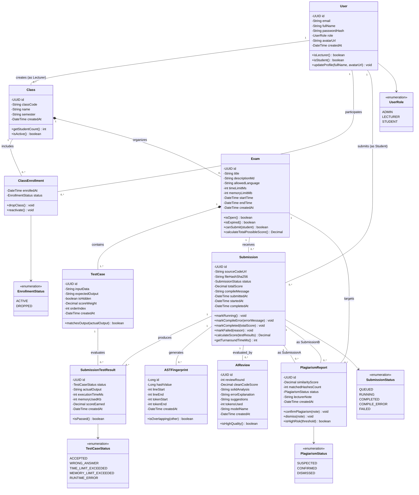
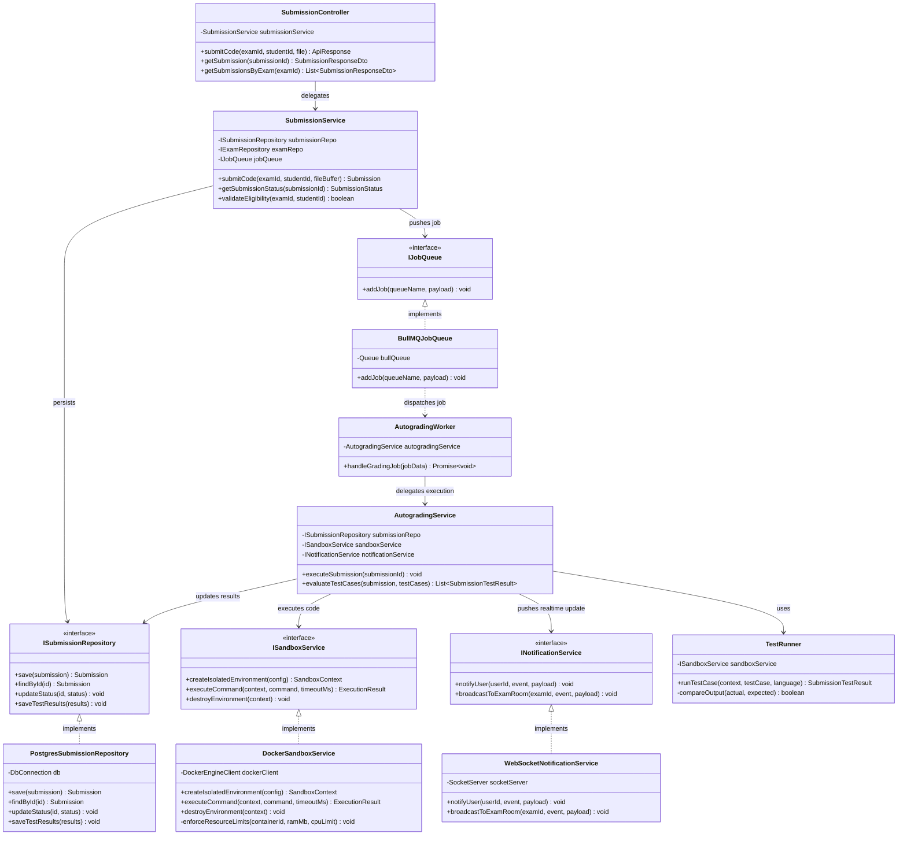
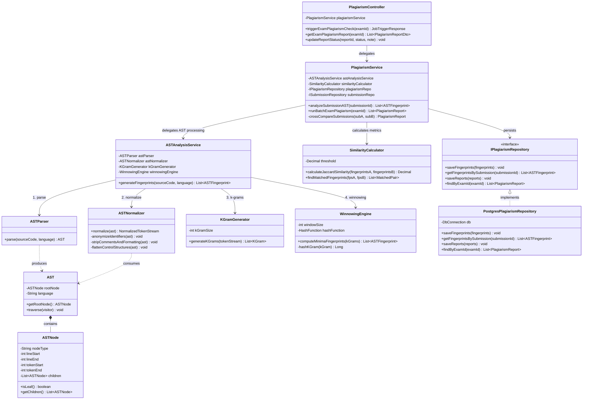
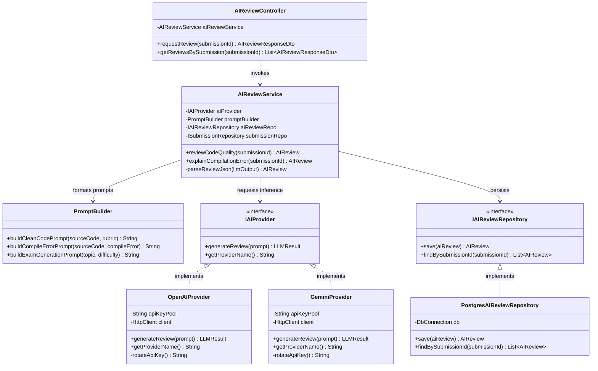
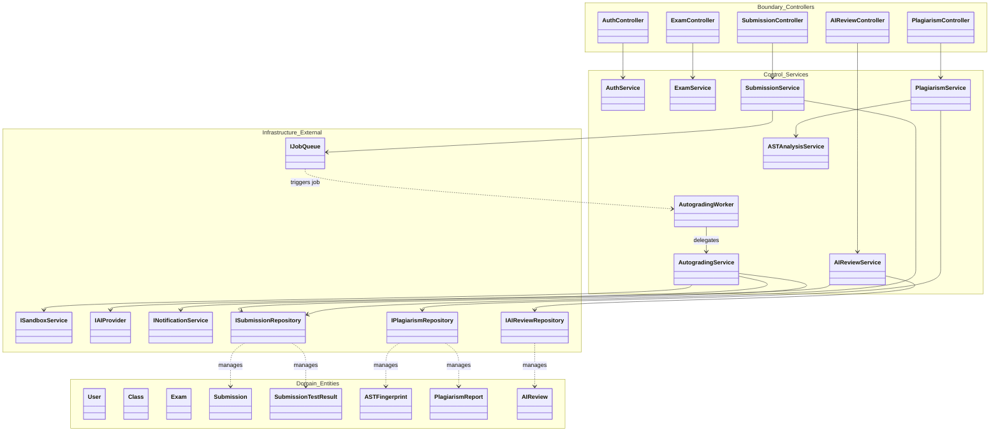

# TÀI LIỆU THIẾT KẾ SƠ ĐỒ LỚP (CLASS DIAGRAM SPECIFICATION)
## DỰ ÁN: AITA-INTELLIGENT (AI-POWERED TEACHING ASSISTANT & AST CODE ANALYTICS PLATFORM)
**Học phần:** SWP391 | **Mô hình Kiến trúc:** Layered Architecture & Entity-Control-Boundary (ECB) | **Ngôn ngữ:** TypeScript / OOP

---

## I. NGUYÊN TẮC THIẾT KẾ VÀ KIẾN TRÚC TỔNG QUAN

Tài liệu thiết kế sơ đồ lớp hệ thống **AITA-Intelligent** tuân thủ nghiêm ngặt các tiêu chuẩn kỹ nghệ phần mềm:
1. **Phân tách trách nhiệm (Single Responsibility Principle - SRP):** Tách bạch rõ giữa dữ liệu nghiệp vụ (Entity), giao tiếp bên ngoài (Boundary/Controller), điều phối luồng nghiệp vụ (Control/Service), và hạ tầng kỹ thuật (Infrastructure/Repository).
2. **Không biến Class Diagram thành ERD:** Loại bỏ các trường khóa ngoại quan hệ dạng ID đơn thuần; thể hiện quan hệ thông qua Associations, Composition, Dependency với đầy đủ **Multiplicity (lực lượng quan hệ)**. Mọi Entity đều chứa các phương thức thể hiện hành vi nghiệp vụ (Business Behaviors).
3. **Loose Coupling & Dependency Inversion:** Trừu tượng hóa tương tác với các hệ thống ngoại vi (Redis, Docker Engine, OpenAI/Gemini, WebSockets) qua các **Interfaces**.
4. **Thể hiện rõ Pipeline Thuật toán RBL:** Phân rã quy trình AST & Winnowing thành các lớp chuyên trách (`ASTParser`, `ASTNormalizer`, `KGramGenerator`, `WinnowingEngine`, `SimilarityCalculator`), không gộp chung vào một Service hay Entity.
5. **Cấu trúc Module hóa:** Hệ thống được chia thành 5 biểu đồ lớp chuyên biệt để đảm bảo tính trực quan và khả thi khi lập trình:
   * **Diagram 1:** Domain Model (Các thực thể nghiệp vụ cốt lõi & Value Objects/Enums).
   * **Diagram 2:** Submission & Docker Sandbox Pipeline (Luồng nhận bài, hàng đợi Redis và chấm code cô lập).
   * **Diagram 3:** AST & Winnowing Plagiarism Engine (Pipeline băm cú pháp, trượt cửa sổ và so khớp ma trận tương đồng).
   * **Diagram 4:** GenAI Review Hub (Module tích hợp LLM hỗ trợ Clean Code và giải nghĩa lỗi).
   * **Diagram 5:** High-Level Architecture Overview (Tổng thể liên kết đa tầng: Controller $\to$ Service $\to$ Repository/Infra $\to$ Domain).

---

## II. DIAGRAM 1: DOMAIN MODEL (CÁC THỰC THỂ CỐT LÕI)

Mô hình Domain chỉ tập trung vào cấu trúc dữ liệu thực thể và các hành vi nội tại của đối tượng, không phụ thuộc vào Database hay Framework.

### 1. Enumerations (Value Types)
* `UserRole`: `ADMIN`, `LECTURER`, `STUDENT`
* `SubmissionStatus`: `QUEUED`, `RUNNING`, `COMPLETED`, `COMPILE_ERROR`, `FAILED`
* `TestCaseStatus`: `ACCEPTED`, `WRONG_ANSWER`, `TIME_LIMIT_EXCEEDED`, `MEMORY_LIMIT_EXCEEDED`, `RUNTIME_ERROR`
* `PlagiarismStatus`: `SUSPECTED`, `CONFIRMED`, `DISMISSED`
* `EnrollmentStatus`: `ACTIVE`, `DROPPED`

### 2. Sơ đồ Mermaid: Domain Model

---

## III. DIAGRAM 2: PHÂN HỆ NỘP BÀI & DOCKER SANDBOX (AUTOGRADING PIPELINE)

Phân hệ này điều phối luồng xử lý bất đồng bộ chuẩn Event-driven: Sinh viên gửi bài qua `SubmissionController` $\to$ `SubmissionService` ghi nhận bài nộp $\to$ Đẩy job vào `IJobQueue` (BullMQ) $\to$ `AutogradingWorker` lắng nghe event từ hàng đợi và nhận job $\to$ Ủy quyền cho `AutogradingService` điều phối $\to$ Khởi tạo Container cô lập qua `DockerSandboxService` $\to$ Chạy `TestRunner` $\to$ Cập nhật kết quả vào Repository và phát thông báo WebSockets về Client.

### Sơ đồ Mermaid: Submission & Sandbox Engine

---

## IV. DIAGRAM 3: PHÂN HỆ PHÂN TÍCH AST & WINNOWING (RBL CORE PIPELINE)

Phân hệ nghiên cứu cốt lõi (RBL) chuyển đổi mã nguồn thành cây cú pháp trừu tượng AST, loại bỏ định danh, băm k-grams, thực thi giải thuật chọn lọc Winnowing và tính toán độ tương đồng (Jaccard / Containment metric) **hoàn toàn trên In-Memory Worker** trước khi lưu kết quả vào PostgreSQL.

### Sơ đồ Mermaid: AST & Plagiarism Engine

---

## V. DIAGRAM 4: PHÂN HỆ TRỢ LÝ AI (GENAI REVIEW HUB)

Phân hệ GenAI nhận bài nộp hoặc log lỗi biên dịch, dùng cơ chế Prompt Builder đóng gói ngữ cảnh và gọi AI Provider (hỗ trợ xoay vòng key và trừu tượng hóa OpenAI / Gemini qua Adapter Pattern) để đánh giá tiêu chuẩn Clean Code, SOLID và giải nghĩa lỗi.

### Sơ đồ Mermaid: GenAI Review Hub

---

## VI. DIAGRAM 5: KIẾN TRÚC TỔNG THỂ ĐA TẦNG (HIGH-LEVEL OVERVIEW)

Sơ đồ tổng hợp minh họa luồng tương tác giữa các tầng kiến trúc: Boundary $\to$ Control $\to$ Infrastructure $\to$ Domain.

---

## VII. BẢNG TỰ THẨM ĐỊNH THIẾT KẾ (DESIGN VERIFICATION CHECKLIST)

Bảng đối chiếu kiểm thử chất lượng thiết kế theo chuẩn Đề án Kỹ nghệ Phần mềm SWP391:

| Hạng mục | Tiêu chuẩn đánh giá | Kết quả kiểm tra | Minh chứng trong tài liệu |
| :--- | :--- | :---: | :--- |
| **Phủ Use Case** | Có đủ các lớp phục vụ 5 phân hệ cốt lõi | **ĐẠT (100%)** | Đã bao hàm Auth, Class, Exam, Submission, Sandbox, AST/Winnowing, Plagiarism, GenAI. |
| **Mô hình ECB** | Phân tách rõ Entity - Control - Boundary | **ĐẠT** | Tách rõ Controller (Boundary), Service (Control), Entity (Domain) và Adapter (Infra). |
| **Trách nhiệm (SRP)** | Không có "God Class" gom toàn bộ logic | **ĐẠT** | `Submission` chỉ quản lý trạng thái bài nộp; logic chấm thuộc `AutogradingService`, sandbox thuộc `DockerSandboxService`. |
| **Thuộc tính & Hành vi** | Method thể hiện Business Behavior, không phải getter/setter thuần | **ĐẠT** | `Exam.isOpen()`, `Submission.calculateScore()`, `TestCase.matchesOutput()`. |
| **Lực lượng quan hệ** | Đầy đủ Multiplicity trên tất cả các Association | **ĐẠT** | Có rõ ràng `1` $\to$ `0..*`, `1` $\to$ `1..*`. Composition (`*--`) cho `Exam *-- TestCase`; Association (`--`) cho `Submission` với `AIReview` và `SubmissionTestResult` để đảm bảo vòng đời độc lập. |
| **Xử lý N - N** | Giải quyết quan hệ nhiều - nhiều qua thực thể liên kết | **ĐẠT** | Quan hệ giữa `User` và `Class` được kết nối qua `ClassEnrollment`. |
| **Tính kế thừa** | Tránh lạm dụng Subclassing không cần thiết | **ĐẠT** | `User` dùng thuộc tính `role: UserRole`, không tạo 3 subclass rỗng `Student`, `Lecturer`, `Admin`. |
| **Loose Coupling** | Tách biệt hệ thống ngoại vi bằng Interface | **ĐẠT** | Có `ISandboxService`, `IJobQueue`, `IAIProvider`, `INotificationService`. |
| **AST/Winnowing Pipeline**| Thể hiện rõ thuật toán RBL ở mức component | **ĐẠT** | Tách bạch `ASTParser` $\to$ `ASTNormalizer` $\to$ `KGramGenerator` $\to$ `WinnowingEngine` $\to$ `SimilarityCalculator`. |
| **E2E Workflow** | Nhìn ra được thứ tự gọi hàm (Who calls Whom) | **ĐẠT** | Thể hiện tường minh luồng Controller $\to$ Service $\to$ Queue $\to$ Worker $\to$ Sandbox $\to$ Socket. |
| **Phân biệt với ERD** | Không copy khóa ngoại database vào attribute class | **ĐẠT** | Các class dùng quan hệ liên kết (Associations) thay vì chứa thuộc tính `student_id`, `exam_id`. |
