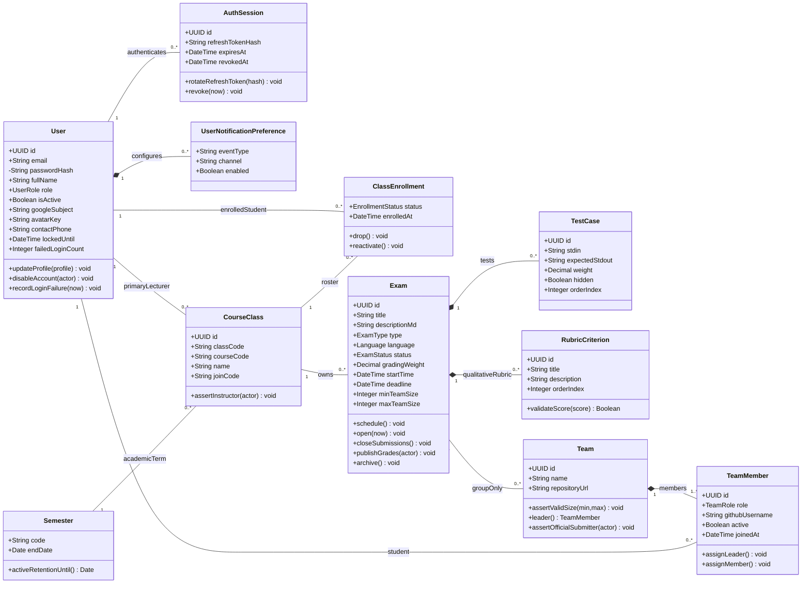
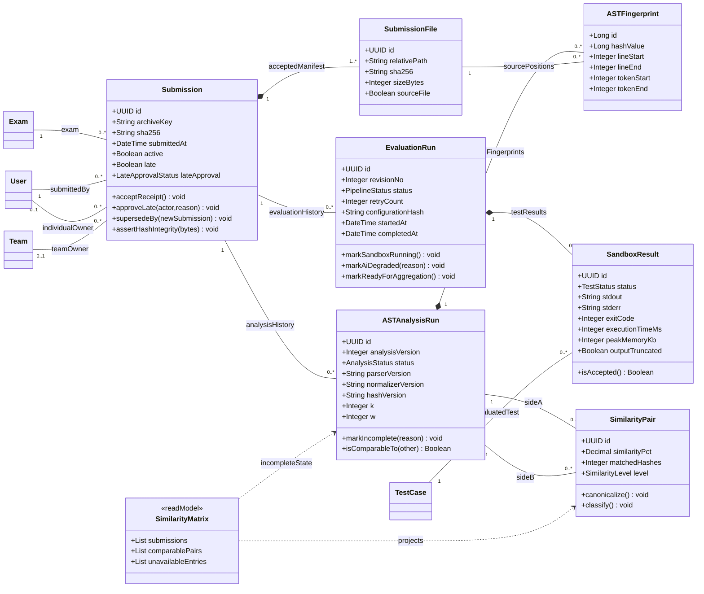
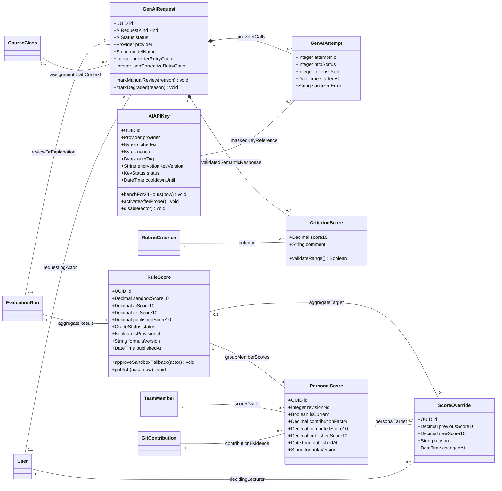
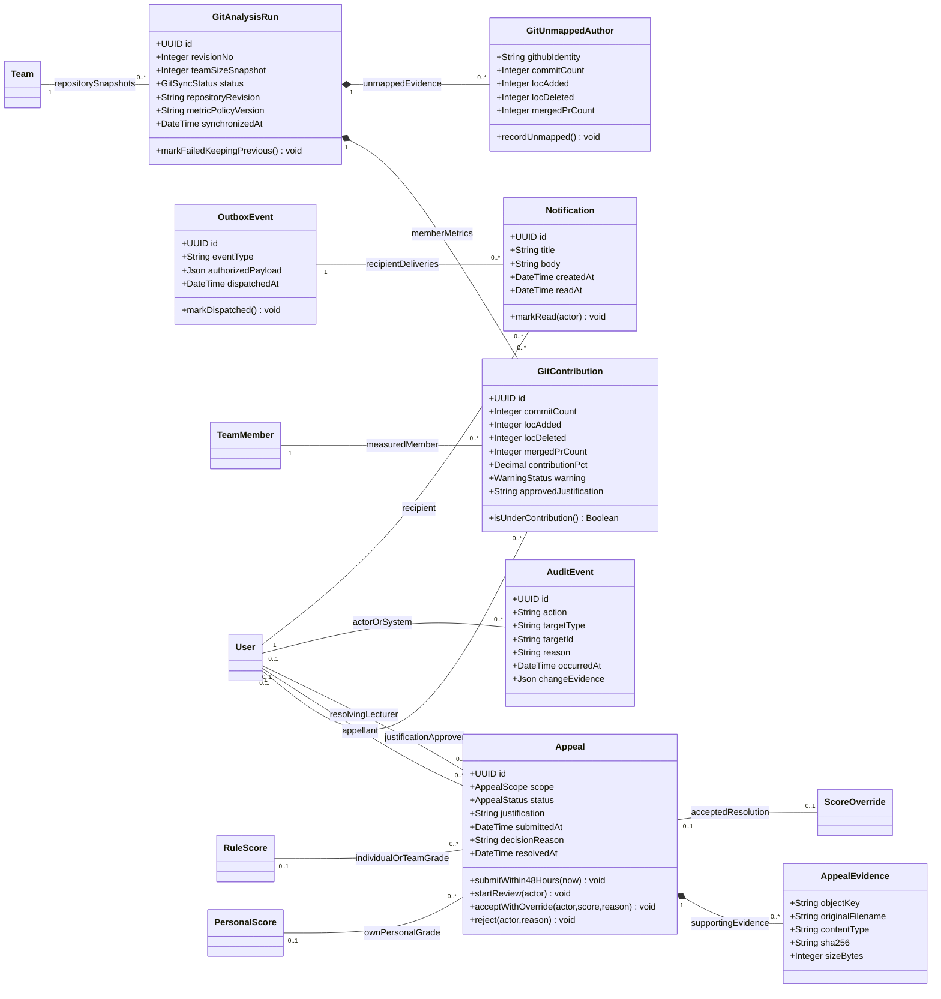
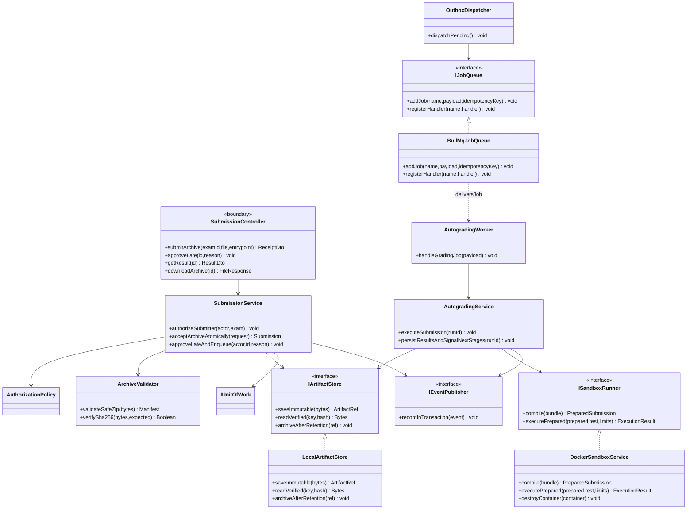
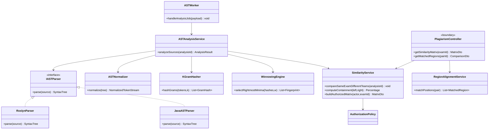
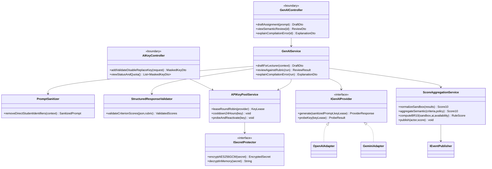
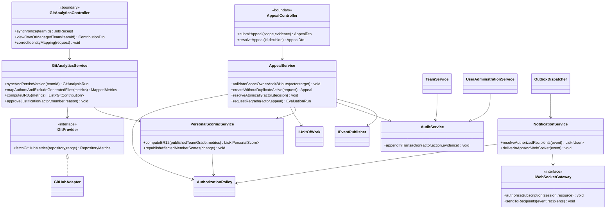

# Thiết kế class diagram — AITA-Intelligent

**Phiên bản:** 3.0 · **Ngày đối chiếu:** 07/10/2026 · **Phạm vi:** thiết kế đích Phase 1 theo SRS.

Nguồn yêu cầu: [AITA_Intelligent_SRS_Group5.docx](document/AITA_Intelligent_SRS_Group5.docx), đặc biệt §4–8 và decision register §12. Thiết kế dữ liệu tương ứng: [DATABASE_DESIGN_3NF.md](DATABASE_DESIGN_3NF.md). Schema/mã nguồn hiện tại là bằng chứng về mức triển khai, không thay thế yêu cầu SRS.

## 1. Phạm vi và cách đọc

Sơ đồ dưới đây là **mô hình thiết kế đích**, gồm lớp nghiệp vụ, service và interface dự kiến. Không đồng nghĩa tất cả lớp đã có trong TypeScript. Mục 11 đối chiếu riêng với code hiện tại. Domain entity là khái niệm nghiệp vụ; Prisma model hiện tại chủ yếu là record dữ liệu, chưa có các method domain trong sơ đồ.

Phase 1 gồm Web App, Auth/profile/dashboard/admin, lớp và roster, Individual/Group Exam, test/rubric/team, ZIP/queue/Docker, GenAI, AST/Winnowing, Git analytics/điểm cá nhân, appeal, notification và audit. Không bổ sung mobile, Peer P2P score, chatbot nhiều lượt, GitLab/Bitbucket, tự đăng ký nhóm hoặc Tree Edit Distance. CI/CD coverage là yêu cầu bên ngoài sản phẩm (ISS-01/02/05/06/07/10).

Baseline ngôn ngữ theo SRS là **C#/.NET 8 và Java/JDK 17**. Python đã có trong code nhưng là mở rộng cần được ghi vào SRS trước khi tính là phạm vi baseline. Chính sách Gmail cá nhân đã được người dùng chấp thuận trong phiên làm việc trước; SRS còn mô tả institutional SSO, vì vậy cần cập nhật yêu cầu email tương ứng, không coi mọi Gmail là bằng chứng thuộc trường.

### Quy ước

- Association có multiplicity; `*--` dùng cho thành phần không có ý nghĩa nghiệp vụ độc lập. Composition không có nghĩa DB phải cascade xóa lịch sử.
- `..>` là dependency; `<|..` là implementation của interface; không tạo superclass rỗng cho Student/Lecturer/Admin.
- `Team Leader` là vai trò của **TeamMember trong một team**, không phải role tài khoản toàn cục.
- `CourseClass` tương ứng model `Class`; `SandboxResult` tương ứng `SubmissionTestResult`; `SimilarityPair` là một ô/cặp của `SimilarityMatrix`, hiện được lưu bằng `PlagiarismReport`.
- ID được giữ để định danh entity; quan hệ domain được biểu diễn bằng association. Khóa ngoại, CHECK và index nằm trong thiết kế database.
- Repository/UoW ở đây là abstraction thiết kế; implementation hiện tại nhiều service gọi trực tiếp Prisma.

## 2. Domain: tài khoản, lớp, exam và team

```mermaid
classDiagram
  direction LR
  class User {
    +UUID id
    +String email
    -String passwordHash
    +String fullName
    +UserRole role
    +Boolean isActive
    +String googleSubject
    +String avatarKey
    +String contactPhone
    +DateTime lockedUntil
    +Integer failedLoginCount
    +updateProfile(profile) void
    +disableAccount(actor) void
    +recordLoginFailure(now) void
  }
  class AuthSession {
    +UUID id
    +String refreshTokenHash
    +DateTime expiresAt
    +DateTime revokedAt
    +rotateRefreshToken(hash) void
    +revoke(now) void
  }
  class UserNotificationPreference {
    +String eventType
    +String channel
    +Boolean enabled
  }
  class Semester {
    +String code
    +Date endDate
    +activeRetentionUntil() Date
  }
  class CourseClass {
    +UUID id
    +String classCode
    +String courseCode
    +String name
    +String joinCode
    +assertInstructor(actor) void
  }
  class ClassEnrollment {
    +EnrollmentStatus status
    +DateTime enrolledAt
    +drop() void
    +reactivate() void
  }
  class Exam {
    +UUID id
    +String title
    +String descriptionMd
    +ExamType type
    +Language language
    +ExamStatus status
    +Decimal gradingWeight
    +DateTime startTime
    +DateTime deadline
    +Integer minTeamSize
    +Integer maxTeamSize
    +schedule() void
    +open(now) void
    +closeSubmissions() void
    +publishGrades(actor) void
    +archive() void
  }
  class TestCase {
    +UUID id
    +String stdin
    +String expectedStdout
    +Decimal weight
    +Boolean hidden
    +Integer orderIndex
  }
  class RubricCriterion {
    +UUID id
    +String title
    +String description
    +Integer orderIndex
    +validateScore(score) Boolean
  }
  class Team {
    +UUID id
    +String name
    +String repositoryUrl
    +assertValidSize(min,max) void
    +leader() TeamMember
    +assertOfficialSubmitter(actor) void
  }
  class TeamMember {
    +UUID id
    +TeamRole role
    +String githubUsername
    +Boolean active
    +DateTime joinedAt
    +assignLeader() void
    +assignMember() void
  }
  User "1" -- "0..*" AuthSession : authenticates
  User "1" *-- "0..*" UserNotificationPreference : configures
  User "1" -- "0..*" CourseClass : primaryLecturer
  Semester "1" -- "0..*" CourseClass : academicTerm
  User "1" -- "0..*" ClassEnrollment : enrolledStudent
  CourseClass "1" -- "0..*" ClassEnrollment : roster
  CourseClass "1" -- "0..*" Exam : owns
  Exam "1" *-- "0..*" TestCase : tests
  Exam "1" *-- "0..*" RubricCriterion : qualitativeRubric
  Exam "1" -- "0..*" Team : groupOnly
  Team "1" *-- "1..*" TeamMember : members
  User "1" -- "0..*" TeamMember : student
```

**Ràng buộc:** Draft Exam có thể chưa có test/rubric nên multiplicity là `0..*`, không phải luôn `1..*`. Trước khi mở exam phải kiểm tra cấu hình chấm phù hợp. Individual Exam không có team; Group Exam cần min/max hợp lệ, repository GitHub và đúng một leader/team. Một Student không thuộc hai team đang hoạt động trong cùng Group Exam; thành viên phải có enrollment ACTIVE trong lớp của exam. SRS yêu cầu repository không trùng giữa các team trong cùng Group Exam (UC24). Khóa cấu hình ảnh hưởng điểm sau khi mở exam là lựa chọn thiết kế để bảo toàn bằng chứng chấm; thay đổi phải có version/audit.

## 3. Domain: submission, chạy chấm và phân tích AST

```mermaid
classDiagram
  direction LR
  class Submission {
    +UUID id
    +String archiveKey
    +String sha256
    +DateTime submittedAt
    +Boolean active
    +Boolean late
    +LateApprovalStatus lateApproval
    +acceptReceipt() void
    +approveLate(actor,reason) void
    +supersedeBy(newSubmission) void
    +assertHashIntegrity(bytes) void
  }
  class SubmissionFile {
    +UUID id
    +String relativePath
    +String sha256
    +Integer sizeBytes
    +Boolean sourceFile
  }
  class EvaluationRun {
    +UUID id
    +Integer revisionNo
    +PipelineStatus status
    +Integer retryCount
    +String configurationHash
    +DateTime startedAt
    +DateTime completedAt
    +markSandboxRunning() void
    +markAiDegraded(reason) void
    +markReadyForAggregation() void
  }
  class SandboxResult {
    +UUID id
    +TestStatus status
    +String stdout
    +String stderr
    +Integer exitCode
    +Integer executionTimeMs
    +Integer peakMemoryKb
    +Boolean outputTruncated
    +isAccepted() Boolean
  }
  class ASTAnalysisRun {
    +UUID id
    +Integer analysisVersion
    +AnalysisStatus status
    +String parserVersion
    +String normalizerVersion
    +String hashVersion
    +Integer k
    +Integer w
    +markIncomplete(reason) void
    +isComparableTo(other) Boolean
  }
  class ASTFingerprint {
    +Long id
    +Long hashValue
    +Integer lineStart
    +Integer lineEnd
    +Integer tokenStart
    +Integer tokenEnd
  }
  class SimilarityPair {
    +UUID id
    +Decimal similarityPct
    +Integer matchedHashes
    +SimilarityLevel level
    +canonicalize() void
    +classify() void
  }
  class SimilarityMatrix {
    <<readModel>>
    +List submissions
    +List comparablePairs
    +List unavailableEntries
  }
  Exam "1" -- "0..*" Submission : exam
  User "1" -- "0..*" Submission : submittedBy
  User "0..1" -- "0..*" Submission : individualOwner
  Team "0..1" -- "0..*" Submission : teamOwner
  Submission "1" *-- "1..*" SubmissionFile : acceptedManifest
  Submission "1" -- "0..*" EvaluationRun : evaluationHistory
  EvaluationRun "1" *-- "0..*" SandboxResult : testResults
  TestCase "1" -- "0..*" SandboxResult : evaluatedTest
  Submission "1" -- "0..*" ASTAnalysisRun : analysisHistory
  ASTAnalysisRun "1" *-- "0..*" ASTFingerprint : selectedFingerprints
  SubmissionFile "1" -- "0..*" ASTFingerprint : sourcePositions
  ASTAnalysisRun "1" -- "0..*" SimilarityPair : sideA
  ASTAnalysisRun "1" -- "0..*" SimilarityPair : sideB
  SimilarityMatrix ..> SimilarityPair : projects
  SimilarityMatrix ..> ASTAnalysisRun : incompleteState
```

**Ownership XOR:** mỗi submission thuộc đúng một Student hoặc một Team; `submittedBy` luôn ghi người upload. Bài cá nhân yêu cầu owner = submitter; bài nhóm yêu cầu submitter là leader tại thời điểm tiếp nhận. Một team có nhiều phiên bản lịch sử nhưng đúng một bài **accepted đang hiệu lực**. Bài Late đang chờ duyệt không thay thế bài hợp lệ hiện tại và không được enqueue.

EvaluationRun là thiết kế bổ sung để chấm lại mà không ghi đè kết quả đã công bố. Retry kỹ thuật dùng lại run/job ID, còn lần chấm lại do Lecturer tạo revision mới. ASTAnalysisRun tách khỏi Sandbox: parse lỗi/thiếu token phải hiển thị unavailable/incomplete, không cho một tỷ lệ 0% giả và không làm mất điểm Sandbox.

## 4. Domain: GenAI, rubric và điểm công bố

```mermaid
classDiagram
  direction LR
  class GenAIRequest {
    +UUID id
    +AIRequestKind kind
    +AIStatus status
    +Provider provider
    +String modelName
    +Integer providerRetryCount
    +Integer jsonCorrectiveRetryCount
    +markManualReview(reason) void
    +markDegraded(reason) void
  }
  class GenAIAttempt {
    +Integer attemptNo
    +Integer httpStatus
    +Integer tokensUsed
    +DateTime startedAt
    +String sanitizedError
  }
  class AIAPIKey {
    +UUID id
    +Provider provider
    +Bytes ciphertext
    +Bytes nonce
    +Bytes authTag
    +String encryptionKeyVersion
    +KeyStatus status
    +DateTime cooldownUntil
    +benchFor24Hours(now) void
    +activateAfterProbe() void
    +disable(actor) void
  }
  class CriterionScore {
    +Decimal score10
    +String comment
    +validateRange() Boolean
  }
  class RuleScore {
    +UUID id
    +Decimal sandboxScore10
    +Decimal aiScore10
    +Decimal netScore10
    +Decimal publishedScore10
    +GradeStatus status
    +Boolean isProvisional
    +String formulaVersion
    +DateTime publishedAt
    +approveSandboxFallback(actor) void
    +publish(actor,now) void
  }
  class PersonalScore {
    +UUID id
    +Integer revisionNo
    +Boolean isCurrent
    +Decimal contributionFactor
    +Decimal computedScore10
    +Decimal publishedScore10
    +DateTime publishedAt
    +String formulaVersion
  }
  class ScoreOverride {
    +UUID id
    +Decimal previousScore10
    +Decimal newScore10
    +String reason
    +DateTime changedAt
  }
  EvaluationRun "0..1" -- "0..*" GenAIRequest : reviewOrExplanation
  CourseClass "0..1" -- "0..*" GenAIRequest : assignmentDraftContext
  User "0..1" -- "0..*" GenAIRequest : requestingActor
  GenAIRequest "1" *-- "0..*" GenAIAttempt : providerCalls
  AIAPIKey "1" -- "0..*" GenAIAttempt : maskedKeyReference
  GenAIRequest "1" *-- "0..*" CriterionScore : validatedSemanticResponse
  RubricCriterion "1" -- "0..*" CriterionScore : criterion
  EvaluationRun "1" -- "0..1" RuleScore : aggregateResult
  RuleScore "1" -- "0..*" PersonalScore : groupMemberScores
  TeamMember "1" -- "0..*" PersonalScore : scoreOwner
  GitContribution "1" -- "0..*" PersonalScore : contributionEvidence
  RuleScore "0..1" -- "0..*" ScoreOverride : aggregateTarget
  PersonalScore "0..1" -- "0..*" ScoreOverride : personalTarget
  User "1" -- "0..*" ScoreOverride : decidingLecturer
```

Request semantic review/error explanation có EvaluationRun; request tạo đề có class context và người yêu cầu, chưa tạo Exam tự động. Hai loại context loại trừ nhau. Response chưa validate không sinh CriterionScore. AIAPIKey không chứa plaintext; decryption chỉ trong adapter, AES-256-GCM master key nằm ngoài DB.

Mọi CriterionScore, RuleScore và PersonalScore dùng thang **0–10**. SRS BR-10: `Net = Sandbox × 4/7 + AI × 3/7`. AI degraded chỉ được dùng Sandbox fallback sau khi Lecturer chấp thuận; cần giữ provisional state và dấu vết phê duyệt. Không cộng Peer P2P. Điểm test trọng số được chuẩn hóa trước khi đưa vào công thức. Publication tách khỏi thời điểm worker hoàn tất; `publishedAt` là mốc 48 giờ của appeal.

Các thuộc tính sandboxScore10/aiScore10/netScore10, computedScore10 và contributionFactor trong domain là read projections, không nhất thiết là cột lưu trữ. DB lưu publishedScore10 như snapshot quyết định công bố; effective score đọc thêm lịch sử ScoreOverride. Association PersonalScore–TeamMember cũng được suy ra qua GitContribution, không yêu cầu FK teamMemberId lặp trong bảng PersonalScore.

## 5. Domain: Git analytics, appeal, notification và audit

```mermaid
classDiagram
  direction LR
  class GitAnalysisRun {
    +UUID id
    +Integer revisionNo
    +Integer teamSizeSnapshot
    +GitSyncStatus status
    +String repositoryRevision
    +String metricPolicyVersion
    +DateTime synchronizedAt
    +markFailedKeepingPrevious() void
  }
  class GitContribution {
    +UUID id
    +Integer commitCount
    +Integer locAdded
    +Integer locDeleted
    +Integer mergedPrCount
    +Decimal contributionPct
    +WarningStatus warning
    +String approvedJustification
    +isUnderContribution() Boolean
  }
  class GitUnmappedAuthor {
    +String githubIdentity
    +Integer commitCount
    +Integer locAdded
    +Integer locDeleted
    +Integer mergedPrCount
    +recordUnmapped() void
  }
  class Appeal {
    +UUID id
    +AppealScope scope
    +AppealStatus status
    +String justification
    +DateTime submittedAt
    +String decisionReason
    +DateTime resolvedAt
    +submitWithin48Hours(now) void
    +startReview(actor) void
    +acceptWithOverride(actor,score,reason) void
    +reject(actor,reason) void
  }
  class AppealEvidence {
    +String objectKey
    +String originalFilename
    +String contentType
    +String sha256
    +Integer sizeBytes
  }
  class AuditEvent {
    +UUID id
    +String action
    +String targetType
    +String targetId
    +String reason
    +DateTime occurredAt
    +Json changeEvidence
  }
  class OutboxEvent {
    +UUID id
    +String eventType
    +Json authorizedPayload
    +DateTime dispatchedAt
    +markDispatched() void
  }
  class Notification {
    +UUID id
    +String title
    +String body
    +DateTime createdAt
    +DateTime readAt
    +markRead(actor) void
  }
  Team "1" -- "0..*" GitAnalysisRun : repositorySnapshots
  GitAnalysisRun "1" *-- "0..*" GitContribution : memberMetrics
  TeamMember "1" -- "0..*" GitContribution : measuredMember
  GitAnalysisRun "1" *-- "0..*" GitUnmappedAuthor : unmappedEvidence
  User "0..1" -- "0..*" GitContribution : justificationApprover
  User "1" -- "0..*" Appeal : appellant
  RuleScore "0..1" -- "0..*" Appeal : individualOrTeamGrade
  PersonalScore "0..1" -- "0..*" Appeal : ownPersonalGrade
  Appeal "1" *-- "0..*" AppealEvidence : supportingEvidence
  User "0..1" -- "0..*" Appeal : resolvingLecturer
  Appeal "0..1" -- "0..1" ScoreOverride : acceptedResolution
  User "0..1" -- "0..*" AuditEvent : actorOrSystem
  OutboxEvent "1" -- "0..*" Notification : recipientDeliveries
  User "1" -- "0..*" Notification : recipient
```

BR-05: `C_i = (0.35 × CommitShare + 0.40 × LOCShare + 0.25 × PRShare) × 100%`, loại file auto-generated. Unmapped authors không được gán ngầm vào leader hoặc bỏ mà không báo Lecturer. BR-12: `factor = clamp(C_i / (100 / teamSize), 0.5, 1.2)`; `Personal = min(10, TeamScore × factor)`. Không chia lại điểm bị trừ, không bật group-normalized balancing.

Appeal target XOR: Individual/Team scope trỏ RuleScore; Personal scope trỏ PersonalScore. Student chỉ appeal điểm cá nhân của mình; Team Leader mới appeal điểm cả nhóm. Duplicate active appeal được kiểm tra theo scope nghiệp vụ (exam + owner/team/member + loại appeal), kể cả khi grade có revision mới. Lecturer phải sở hữu lớp, có lý do cho accept/reject; quyết định, override và notification được ghi atomically. Audit append-only; JSON evidence không thay cho FK nghiệp vụ.

## 6. Application: Auth, profile, class, roster và team

```mermaid
classDiagram
  class PortalController {
    <<boundary>>
    +login(request) SessionDto
    +updateProfile(request) ProfileDto
    +dashboard() DashboardDto
  }
  class ClassController {
    <<boundary>>
    +createClass(request) ClassDto
    +previewRoster(file,mapping) ImportPreview
    +commitRoster(receipt) ImportSummary
  }
  class ExamController {
    <<boundary>>
    +createExam(request) ExamDto
    +configureTestsAndRubric(request) void
    +transitionLifecycle(request) void
  }
  class TeamController {
    <<boundary>>
    +createOrImportTeams(request) TeamDto
    +replaceLeader(request) void
  }
  class AdminUserController {
    <<boundary>>
    +changeRole(request) void
    +changeAccountStatus(request) void
  }
  class AuthService {
    +googleLogin(credential,nonce) SessionDto
    +login(email,password) SessionDto
    +refresh(token) SessionDto
    +logout(session) void
  }
  class ProfileService {
    +updateAllowedFields(actor,profile) void
    +uploadAvatar(actor,image) void
  }
  class DashboardQueryService {
    +getAuthorizedSummary(actor) DashboardDto
  }
  class RosterImportService {
    +preview(classId,file,mapping) ImportPreview
    +commitAtomically(classId,receipt) ImportSummary
  }
  class ClassService {
    +createClass(actor,metadata) CourseClass
    +manageEnrollment(actor,student) void
  }
  class ExamService {
    +createExam(actor,configuration) Exam
    +saveRubricAndTests(actor,configuration) void
    +transition(actor,nextState) void
  }
  class TeamService {
    +validateMembershipAndSize(team) void
    +replaceLeaderAtomically(actor,old,new,reason) void
  }
  class UserAdministrationService {
    +changeRoleAndRevokeSessions(actor,user,role) void
    +disableAndRevokeSessions(actor,user) void
  }
  class AuthorizationPolicy {
    +assertClassAccess(actor,resource) void
    +assertSubmissionAccess(actor,submission) void
    +assertOfficialSubmitter(actor,exam,team) void
  }
  class IUnitOfWork {
    <<interface>>
    +transaction(operation) void
  }
  PortalController --> AuthService
  PortalController --> ProfileService
  PortalController --> DashboardQueryService
  ClassController --> ClassService
  ClassController --> RosterImportService
  ExamController --> ExamService
  TeamController --> TeamService
  AdminUserController --> UserAdministrationService
  RosterImportService --> IUnitOfWork
  TeamService --> IUnitOfWork
  TeamService --> AuthorizationPolicy
  ExamService --> AuthorizationPolicy
  UserAdministrationService --> IUnitOfWork
```

AuthService áp dụng mật khẩu ≥10 ký tự, bcrypt cost ≥12/Argon2id, khóa 15 phút sau 5 lỗi liên tiếp; JWT 15 phút, refresh 7 ngày và cookie HttpOnly/Secure/SameSite=Strict. Avatar PNG/JPG <2 MB. Service không cho profile tự đổi role. Role/status change revoke session và phát audit trong transaction. Import `.xlsx` <10 MB có preview/mapping, kiểm tra mọi dòng và rollback toàn batch khi lỗi không thể phục hồi.

Các service trên phụ thuộc IUserRepository/IClassRepository/IExamRepository/ITeamRepository và IUnitOfWork; repository không phải actor ngoài hệ thống. AuthorizationPolicy được dùng lại ở REST, read model, download artifact và WebSocket subscription, không chỉ kiểm tra ở UI.

## 7. Application: ZIP, queue và Docker

```mermaid
classDiagram
  class SubmissionController {
    <<boundary>>
    +submitArchive(examId,file,entrypoint) ReceiptDto
    +approveLate(id,reason) void
    +getResult(id) ResultDto
    +downloadArchive(id) FileResponse
  }
  class SubmissionService {
    +authorizeSubmitter(actor,exam) void
    +acceptArchiveAtomically(request) Submission
    +approveLateAndEnqueue(actor,id,reason) void
  }
  class ArchiveValidator {
    +validateSafeZip(bytes) Manifest
    +verifySha256(bytes,expected) Boolean
  }
  class IArtifactStore {
    <<interface>>
    +saveImmutable(bytes) ArtifactRef
    +readVerified(key,hash) Bytes
    +archiveAfterRetention(ref) void
  }
  class LocalArtifactStore {
    +saveImmutable(bytes) ArtifactRef
    +readVerified(key,hash) Bytes
    +archiveAfterRetention(ref) void
  }
  class IJobQueue {
    <<interface>>
    +addJob(name,payload,idempotencyKey) void
    +registerHandler(name,handler) void
  }
  class BullMqJobQueue {
    +addJob(name,payload,idempotencyKey) void
    +registerHandler(name,handler) void
  }
  class OutboxDispatcher {
    +dispatchPending() void
  }
  class AutogradingWorker {
    +handleGradingJob(payload) void
  }
  class AutogradingService {
    +executeSubmission(runId) void
    +persistResultsAndSignalNextStages(runId) void
  }
  class ISandboxRunner {
    <<interface>>
    +compile(bundle) PreparedSubmission
    +executePrepared(prepared,test,limits) ExecutionResult
  }
  class DockerSandboxService {
    +compile(bundle) PreparedSubmission
    +executePrepared(prepared,test,limits) ExecutionResult
    +destroyContainer(container) void
  }
  class IEventPublisher {
    <<interface>>
    +recordInTransaction(event) void
  }
  SubmissionController --> SubmissionService
  SubmissionService --> AuthorizationPolicy
  SubmissionService --> ArchiveValidator
  SubmissionService --> IArtifactStore
  SubmissionService --> IUnitOfWork
  SubmissionService --> IEventPublisher
  IArtifactStore <|.. LocalArtifactStore
  IJobQueue <|.. BullMqJobQueue
  OutboxDispatcher --> IJobQueue
  BullMqJobQueue ..> AutogradingWorker : deliversJob
  AutogradingWorker --> AutogradingService
  AutogradingService --> IArtifactStore
  AutogradingService --> ISandboxRunner
  ISandboxRunner <|.. DockerSandboxService
  AutogradingService --> IEventPublisher
```

Giới hạn SRS: ZIP ≤25 MiB, ratio ≤100:1, ≤1000 file, chặn traversal; Docker 512 MiB/1 vCPU/10 giây mỗi test và tắt networking. Expanded-size cap, PID/output cap, compiler timeout và non-root/read-only rootfs là kiểm soát bổ sung của thiết kế vận hành. Không gửi expected output vào runtime container; lưu stdout/stderr/exit code, bảo vệ test ẩn và dọn container cả khi lỗi.

Outbox ghi receipt + thay đổi active submission + grading event trong cùng transaction. Redis không chứa ZIP. Payload tối thiểu có submissionId, examId, evaluationRunId và team context khi có; job ID ổn định theo run/stage. NFR-REL-001 yêu cầu initial attempt + tối đa 3 retries, backoff **5/15/45 giây**. Retry không tạo submission hay điểm mới; người vận hành không lấy `QUEUED` làm bằng chứng đã chấm xong.

## 8. Application: RBL và GenAI

```mermaid
classDiagram
  class PlagiarismController {
    <<boundary>>
    +getSimilarityMatrix(examId) MatrixDto
    +getMatchedRegions(pairId) ComparisonDto
  }
  class ASTWorker {
    +handleAnalysisJob(payload) void
  }
  class ASTAnalysisService {
    +analyzeSources(analysisId) AnalysisResult
  }
  class IASTParser {
    <<interface>>
    +parse(source) SyntaxTree
  }
  class RoslynParser {
    +parse(source) SyntaxTree
  }
  class JavaASTParser {
    +parse(source) SyntaxTree
  }
  class ASTNormalizer {
    +normalize(tree) NormalizedTokenStream
  }
  class KGramHasher {
    +hashGrams(tokens,k) List~GramHash~
  }
  class WinnowingEngine {
    +selectRightmostMinima(hashes,w) List~Fingerprint~
  }
  class SimilarityService {
    +compareSameExamDifferentTeams(analysisId) void
    +computeContainment(left,right) Percentage
    +buildAuthorizedMatrix(actor,examId) MatrixDto
  }
  class RegionAlignmentService {
    +matchPositions(pair) List~MatchedRegion~
  }
  ASTWorker --> ASTAnalysisService
  ASTAnalysisService --> IASTParser
  IASTParser <|.. RoslynParser
  IASTParser <|.. JavaASTParser
  ASTAnalysisService --> ASTNormalizer
  ASTAnalysisService --> KGramHasher
  ASTAnalysisService --> WinnowingEngine
  ASTAnalysisService --> SimilarityService
  PlagiarismController --> SimilarityService
  PlagiarismController --> RegionAlignmentService
  SimilarityService --> AuthorizationPolicy
```

Normalizer trừu tượng hóa identifier **và literal value**, bỏ comment/formatting nhưng giữ cấu trúc/operator. Winnowing chọn minimum ngoài cùng bên phải khi tie; hash k-gram phải giữ ranh giới token. Dùng tập hash phân biệt và **containment** theo BR-03, không thay bằng Jaccard. Chỉ so sánh cùng exam, cùng pipeline/config tương thích; Group chỉ khác team. AST incomplete/ít token xuất hiện như unavailable trong matrix. MatchedRegion tham chiếu đường dẫn nguồn và vị trí fingerprint hai phía; heatmap/read model không cần một bảng riêng cho mỗi ô trống.

Matrix hiện hành cho Group chọn bài official đang active của mỗi team và analysis version tương thích. Submission superseded/analysis history vẫn được giữ cho evidence; không trộn chúng vào report hiện hành như nhiều bài chính thức của cùng team.

```mermaid
classDiagram
  class GenAIController {
    <<boundary>>
    +draftAssignment(prompt) DraftDto
    +viewSemanticReview(id) ReviewDto
    +explainCompilationError(id) ExplanationDto
  }
  class AIKeyController {
    <<boundary>>
    +addValidateDisableReplaceKey(request) MaskedKeyDto
    +viewStatusAndQuota() List~MaskedKeyDto~
  }
  class GenAIService {
    +draftForLecturer(context) DraftDto
    +reviewAgainstRubric(run) ReviewResult
    +explainCompilationError(run) ExplanationDto
  }
  class PromptSanitizer {
    +removeDirectStudentIdentifiers(context) SanitizedPrompt
  }
  class StructuredResponseValidator {
    +validateCriterionScores(json,rubric) ValidatedScores
  }
  class APIKeyPoolService {
    +leaseRoundRobin(provider) KeyLease
    +cooldown24Hours(key) void
    +probeAndReactivate(key) void
  }
  class ISecretProtector {
    <<interface>>
    +encryptAES256GCM(secret) EncryptedSecret
    +decryptInMemory(secret) String
  }
  class IGenAIProvider {
    <<interface>>
    +generate(sanitizedPrompt,keyLease) ProviderResponse
    +probeKey(keyLease) ProbeResult
  }
  class OpenAIAdapter
  class GeminiAdapter
  class ScoreAggregationService {
    +normalizeSandbox(results) Score10
    +aggregateSemantic(criteria,policy) Score10
    +computeBR10(sandbox,ai,availability) RuleScore
    +publish(actor,score) void
  }
  GenAIController --> GenAIService
  AIKeyController --> APIKeyPoolService
  GenAIService --> PromptSanitizer
  GenAIService --> StructuredResponseValidator
  GenAIService --> APIKeyPoolService
  GenAIService --> IGenAIProvider
  IGenAIProvider <|.. OpenAIAdapter
  IGenAIProvider <|.. GeminiAdapter
  APIKeyPoolService --> ISecretProtector
  GenAIService --> ScoreAggregationService
  ScoreAggregationService --> IEventPublisher
```

JSON sai có đúng một corrective retry rồi manual review. Rate limit chuyển key sang cooldown 24h, chỉ probe thành công mới quay lại active. Provider retries và worker retries là hai ngân sách khác nhau. Exhausted keys giữ Sandbox/AST và trạng thái degraded, không tự coi AI = 0. Tạo đề là draft cần Lecturer xem và lưu; giải thích lỗi là single-turn, không chatbot. Payload/log không chứa key rõ, họ tên, email hoặc mã sinh viên; provider dùng zero-retention mode khi có.

## 9. Application: Git, điểm cá nhân và appeal

```mermaid
classDiagram
  class GitAnalyticsController {
    <<boundary>>
    +synchronize(teamId) JobReceipt
    +viewOwnOrManagedTeam(teamId) ContributionDto
    +correctIdentityMapping(request) void
  }
  class IGitProvider {
    <<interface>>
    +fetchGitHubMetrics(repository,range) RepositoryMetrics
  }
  class GitHubAdapter
  class GitAnalyticsService {
    +syncAndPersistVersion(teamId) GitAnalysisRun
    +mapAuthorsAndExcludeGeneratedFiles(metrics) MappedMetrics
    +computeBR05(metrics) List~GitContribution~
    +approveJustification(actor,member,reason) void
  }
  class PersonalScoringService {
    +computeBR12(publishedTeamGrade,metrics) List~PersonalScore~
    +republishAffectedMemberScores(change) void
  }
  class AppealController {
    <<boundary>>
    +submitAppeal(scope,evidence) AppealDto
    +resolveAppeal(id,decision) AppealDto
  }
  class AppealService {
    +validateScopeOwnerAnd48Hours(actor,target) void
    +createWithoutDuplicateActive(request) Appeal
    +resolveAtomically(actor,decision) void
    +requestRegrade(actor,appeal) EvaluationRun
  }
  class AuditService {
    +appendInTransaction(actor,action,evidence) void
  }
  class NotificationService {
    +resolveAuthorizedRecipients(event) List~User~
    +deliverInAppAndWebSocket(event) void
  }
  class IWebSocketGateway {
    <<interface>>
    +authorizeSubscription(session,resource) void
    +sendToRecipients(event,recipients) void
  }
  GitAnalyticsController --> GitAnalyticsService
  GitAnalyticsService --> IGitProvider
  IGitProvider <|.. GitHubAdapter
  GitAnalyticsService --> PersonalScoringService
  PersonalScoringService --> AuthorizationPolicy
  AppealController --> AppealService
  AppealService --> AuthorizationPolicy
  AppealService --> IUnitOfWork
  AppealService --> PersonalScoringService
  AppealService --> AuditService
  AppealService --> IEventPublisher
  TeamService --> AuditService
  UserAdministrationService --> AuditService
  NotificationService --> AuthorizationPolicy
  NotificationService --> IWebSocketGateway
  OutboxDispatcher --> NotificationService
```

GitHub lỗi giữ snapshot thành công trước; unmapped authors/không có dữ liệu hiển thị rõ, không tạo PersonalScore giả. Team score override phải tính lại điểm các thành viên liên quan bằng BR-12 rồi ghi version/audit; personal override chỉ tác động đúng thành viên. Cập nhật grade/appeal/audit/outbox cùng transaction; notification delivery có thể retry/idempotent ngoài transaction.

Notifications hướng tới owner, team members và Lecturer/Admin được quyền; không broadcast nguyên dữ liệu tới room chỉ dựa trên exam ID. WebSocket mất kết nối thì client lấy lại in-app state. Lịch sử notification dài hạn không phải tiêu chí Phase 1; retained audit/ZIP/log theo chính sách riêng.

## 10. Lifecycle và phép tính chuẩn

### Value objects và contract không lưu thành bảng

| Contract | Nội dung |
| --- | --- |
| SourceBundle / PreparedSubmission | Ngôn ngữ, entrypoint, manifest/source bytes và compiled artifacts có giới hạn; không chứa expected output |
| SandboxLimits | memory=512 MiB, cpu=1.0, timeout=10000 ms/test theo SRS; output/PID/compiler limits là cấu hình hardening |
| ExecutionResult | stdout, stderr, exitCode, duration, peak memory, timeout/OOM/outputTruncated |
| SyntaxTree / AST node | kind, children và source positions; dữ liệu transient trong parser adapter |
| NormalizedTokenStream | Token structural đã abstract identifier/literal, giữ liên kết về source file và dòng/token |
| GramHash / Fingerprint | Hash k-gram, token span, line span và file reference; minimum-selection không bỏ source mapping |
| MatchedRegion | File/span A và B, matched hash và loại match; dùng cho side-by-side |
| GradingJobPayload | submissionId, examId, evaluationRunId, teamId khi có; idempotency key theo run/stage |
| GradeInputs | Sandbox10, AI10/availability, contribution snapshot, formula version và fallback approval |

### Status domains

| Khái niệm | Trạng thái thiết kế / quy tắc |
| --- | --- |
| UserRole | STUDENT, LECTURER, ADMIN; TeamRole riêng MEMBER/LEADER |
| ExamStatus | DRAFT → SCHEDULED → ACTIVE_OPEN → SUBMISSION_CLOSED → GRADING_PENDING → GRADES_PUBLISHED → ARCHIVED |
| Submission intake | RECEIVED; Late/PENDING giữ ngoài grading queue; approved/accepted → QUEUED; superseded là lịch sử không hiệu lực |
| EvaluationRun | QUEUED → SANDBOX_RUNNING → GENAI_REVIEWING/AI_REVIEW_SKIPPED → AST_ANALYZING → SCORE_AGGREGATE → GRADED/PLAGIARISM_FLAGGED; EXECUTION_ERROR và FAILED_QUEUEING được ghi riêng |
| Independent stage status | Sandbox result, AI status, AST status độc lập; pipeline summary không xóa kết quả stage đã xong |
| AIStatus | PENDING, RUNNING, SUCCEEDED, NEEDS_MANUAL_REVIEW, DEGRADED, SKIPPED, FAILED |
| TestStatus | ACCEPTED, WRONG_ANSWER, TIME_LIMIT_EXCEEDED, MEMORY_LIMIT_EXCEEDED, RUNTIME_ERROR; COMPILE_ERROR ở run compiler outcome; OUTPUT_LIMIT_EXCEEDED là bổ sung vận hành |
| AnalysisStatus | PENDING, RUNNING, COMPLETED, INCOMPLETE, FAILED; ít token phải unavailable |
| SimilarityLevel | LOW <50%; MODERATE 50–<80%; SUSPECTED ≥80%; phát hiện không tự kết luận vi phạm |
| GradeStatus | COMPUTED, PROVISIONAL, NEEDS_MANUAL_REVIEW, PUBLISHED, SUPERSEDED; có publishedAt riêng và isProvisional vẫn giữ sau publication |
| AppealStatus | SUBMITTED → IN_REVIEW → ACCEPTED/REJECTED; hai giá trị cuối là kết quả đóng appeal, tương ứng APPEAL_CLOSED trong hình SRS |
| AI key status | PENDING_VALIDATION, ACTIVE, COOLDOWN, DISABLED, INVALID/EXHAUSTED; cooldown không tự active nếu chưa probe |
| GitSyncStatus | PENDING, RUNNING, COMPLETED, FAILED, UNAVAILABLE |

Tính toán tại worker/service, DB lưu version và evidence:

1. `Sandbox10 = 10 × sum(weight của test ACCEPTED) / sum(weight tất cả test)`; tổng weight phải >0 để tính. Đây là cách chuẩn hóa thiết kế để đưa điểm test vào thang BR-10.
2. `Net10 = Sandbox10 × 4/7 + AI10 × 3/7`; fallback phải có phê duyệt, không tự phân bổ AI weight sang thành phần khác.
3. `SimilarityPct = 100 × |F_A ∩ F_B| / min(|F_A|,|F_B|)` với F là tập hash phân biệt. Tập rỗng/incomplete → unavailable, không chia 0.
4. `C_i = 100 × (0.35 × CommitShare_i + 0.40 × LOCShare_i + 0.25 × PRShare_i)`.
5. `Personal10 = min(10, effectiveTeamScore10 × clamp(C_i/(100/teamSize),0.5,1.2))`.

SRS chưa định lượng cách gộp CriterionScores thành AI10, định nghĩa LOC dùng additions/deletions/net, hoặc denominator Git bằng 0. Thiết kế giữ policy version và trạng thái NEEDS_POLICY/UNAVAILABLE cho các trường hợp đó; không tự áp một công thức khác hay tái chuẩn hóa trọng số. Trước triển khai scoring, nhóm phải chốt các policy này trong quyết định thiết kế/SRS. Không phải thiếu model: dữ liệu và service đủ để lưu/áp policy sau khi được chốt.

## 11. Đối chiếu với mã nguồn hiện tại

| Thành phần thiết kế | Có trong repo | Khoảng cách cần triển khai |
| --- | --- | --- |
| Auth/session | AuthService, authRouter, User/AuthSession | Profile/contact/preferences, avatar upload, khóa 5 lỗi/15 phút; minimum password hiện 8, SRS yêu cầu 10; UI admin role/status |
| Class/import | ClassService, classAccess, RosterImportService | courseCode, joinCode, semester end/retention và quản lý metadata đầy đủ |
| Exam/rubric/team | ExamService, Exam/TestCase | type/lifecycle/gradingWeight, rubric, team/member/leader/repository |
| ZIP/Sandbox | SubmissionService, submissionRouter, DockerSandboxService | Duplicate hash theo BR-07; late approval; group ownership/supersession; evaluation history; SRS 512 MiB/10s baseline hiện cho cấu hình thấp hơn |
| ZIP ratio policy | readZip trong submission-archive.ts | Hiện có ngưỡng miễn kiểm tra ratio cho entry ≤1 MiB; cần chặn đúng ≤100:1 theo NFR-SEC-004 |
| Queue | IJobQueue/BullMqJobQueue, AutogradingWorker, recovery | Hiện attempts=3 tổng lần, exponential delay=1s; cần initial+3 retries 5/15/45s. Outbox đích chưa có |
| RBL | RblService, winnow/rightmostMinima/similarity, ASTFingerprint/PlagiarismReport | Literal hiện còn giá trị; cần abstraction theo FR-AST-002; group filtering, incomplete thay 0%, heatmap và side-by-side |
| GenAI/điểm | AIReview chỉ có model | Chưa có provider pipeline/key pool, criterion scores, score aggregation/publication/override |
| Git/personal/appeal/audit | Chưa có module/model tương ứng | Triển khai domain và service mục 4–5, 8–9 |
| Notifications | Frontend polling | Chưa có in-app persisted events/WebSocket/delivery authorization |
| Retention | ZIP và JSONL local | Chưa có semester-end anchor, archive scheduler và chính sách 12 tháng |

`DockerSandboxService` hiện có compile/executePrepared/parseAst, **không implements interface ISandboxService hiện có**. Interface hiện tại là execute(rawCode,...) cho mock legacy; diagram đích dùng ISandboxRunner để tránh mô tả một quan hệ implementation không tồn tại. Python parser/runner và Gmail policy là khác biệt baseline đã nêu mục 1.

## 12. Traceability đủ 24 use case

| SRS UC | Boundary / Control chính | Entity / dữ liệu chính |
| --- | --- | --- |
| UC01 Register/Login | PortalController, AuthService | User, AuthSession |
| UC02 Profile | ProfileService | User, UserNotificationPreference, avatar artifact |
| UC03 Excel import | ClassController, RosterImportService, IUnitOfWork | User, ClassEnrollment |
| UC04 Dashboard/admin | DashboardQueryService, UserAdministrationService | Authorized read models, User, AuditEvent |
| UC05 Class | ClassService | CourseClass, Semester, ClassEnrollment |
| UC06 Exam | ExamService | Exam, lifecycle/gradingWeight |
| UC07 Tests/rubric | ExamService | TestCase, RubricCriterion |
| UC08 Submission | SubmissionService, ArchiveValidator | Submission, SubmissionFile, TeamMember |
| UC09 Docker | AutogradingWorker/Service, ISandboxRunner | EvaluationRun, SandboxResult |
| UC10 Result/diagnostics | SubmissionController, AuthorizationPolicy | EvaluationRun, results/log artifacts |
| UC11 AI draft | GenAIService | GenAIRequest draft, Lecturer-reviewed exam data |
| UC12 Semantic review | GenAIService, StructuredResponseValidator | GenAIRequest, CriterionScore, RuleScore |
| UC13 Compile explanation | GenAIService | Explanation request/response, compiler diagnostics |
| UC14 Key rotation | AIKeyController, APIKeyPoolService | AIAPIKey, GenAIAttempt |
| UC15 AST | ASTWorker, IASTParser, ASTNormalizer | ASTAnalysisRun, normalized tokens |
| UC16 Winnowing | KGramHasher, WinnowingEngine, SimilarityService | ASTFingerprint, SimilarityPair |
| UC17 Matrix/compare | PlagiarismController, RegionAlignmentService | SimilarityMatrix read model, source positions |
| UC18 Queue | IJobQueue, OutboxDispatcher | EvaluationRun, OutboxEvent, Redis job |
| UC19 Git | GitAnalyticsService, GitHubAdapter | GitAnalysisRun, GitContribution, GitUnmappedAuthor |
| UC20 Teamwork report | GitAnalyticsController, PersonalScoringService | Contribution metrics, PersonalScore |
| UC21 Appeal | AppealService | Appeal, AppealEvidence, published grade target |
| UC22 Resolve appeal | AppealService, AuditService | ScoreOverride, Appeal, grade revision, AuditEvent |
| UC23 Notifications | NotificationService, IWebSocketGateway | OutboxEvent, Notification, authorized recipients |
| UC24 Teams | TeamService | Team, TeamMember, leader-change AuditEvent |

Checklist đọc diagram: không lẫn Team Leader với UserRole; ownership XOR; draft test/rubric multiplicity; baseline C#/Java; thang 0–10/BR-10; cross-team similarity; late pending trước queue; publish-time appeal 48h; key encryption/cooldown; Git contribution/personal score; regrade history và audit; WebSocket có authorization. Việc các requirement được ánh xạ trong thiết kế không thay cho kiểm thử nghiệm thu hoặc chứng minh hệ thống đã triển khai đủ.
