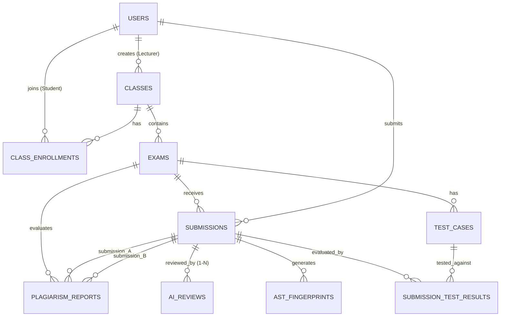

# TÀI LIỆU THIẾT KẾ CƠ SỞ DỮ LIỆU QUAN HỆ CHUẨN 3NF (BẢN CẬP NHẬT HOÀN THIỆN)
## DỰ ÁN: AITA-INTELLIGENT (AI-POWERED TEACHING ASSISTANT & AST CODE ANALYTICS PLATFORM)
**Học phần:** SWP391 | **Phiên bản:** 2.0 (Production-Ready for 10-Week Sprint) | **Hệ CSDL:** PostgreSQL 15+

---

## I. TỔNG QUAN VÀ PHẠM VI (OVERVIEW & SCOPE)

Cơ sở dữ liệu của hệ thống **AITA-Intelligent** được thiết kế phục vụ toàn diện cho 5 phân hệ cốt lõi trong đề án 10 tuần:
1. **Portal & Auth Subsystem:** Quản lý người dùng, phân quyền (Admin, Giảng viên, Sinh viên), lớp học và thành viên lớp học.
2. **Exam & Test Case Management:** Quản lý bài tập, kỳ thi thực hành, hạn nộp, cấu hình tài nguyên Docker Sandbox (CPU time, RAM) và bộ test cases (StdIn/StdOut) có đánh số thứ tự duy nhất.
3. **Docker Autograding Sandbox:** Ghi nhận phiên nộp bài (`submissions`), thời gian hàng đợi/thực thi (`submitted_at`, `started_at`, `completed_at`), mã băm toàn vẹn SHA-256 và kết quả chi tiết từng testcase (`submission_test_results`).
4. **AST Plagiarism Detection (RBL Core):** Lưu trữ các hash fingerprint trích xuất từ cây cú pháp AST theo thuật toán Winnowing (`ast_fingerprints`) kèm tọa độ dòng (`line_start`, `line_end`) và token (`token_start`, `token_end`) để hiển thị trực quan đoạn code trùng lặp (side-by-side diff). Enforce tính toàn vẹn cấp cơ sở dữ liệu cho biên bản so khớp (`plagiarism_reports`) chống trùng lặp hoán vị $A-B / B-A$.
5. **GenAI Review Hub:** Lưu lịch sử các lần review mã nguồn (Clean Code, SOLID, giải nghĩa lỗi) hỗ trợ cơ chế chấm lại nhiều lần (`ai_reviews`, quan hệ $1 - N$).

Toàn bộ mô hình tuân thủ nghiêm ngặt **Dạng chuẩn 3 (Third Normal Form - 3NF)**, đồng thời áp dụng các Composite Foreign Keys và Indexes tối ưu cho môi trường thực thi lớn.

---

## II. SƠ ĐỒ QUAN HỆ THỰC THỂ (ERD - ENTITY RELATIONSHIP DIAGRAM)



---

## III. ĐẶC TẢ CHI TIẾT CÁC THỰC THỂ (DATA DICTIONARY)

### 1. Phân hệ Quản trị & Người dùng (Auth & Portal)

#### 1.1. Bảng `users`
Lưu trữ thông tin tài khoản người dùng hệ thống.
* **Khóa chính (PK):** `id` (UUID)
* **Thuộc tính:**
  | Tên cột | Kiểu dữ liệu | Ràng buộc | Mô tả |
  | :--- | :--- | :--- | :--- |
  | `id` | UUID | PK, DEFAULT uuid_generate_v4() | Định danh duy nhất người dùng |
  | `email` | VARCHAR(100) | UNIQUE, NOT NULL | Email FPT (`@fpt.edu.vn` / `@fe.edu.vn`) |
  | `password_hash` | VARCHAR(255) | NULL | Hash mật khẩu (NULL nếu dùng Google SSO) |
  | `full_name` | VARCHAR(100) | NOT NULL | Họ và tên đầy đủ |
  | `role` | VARCHAR(20) | NOT NULL | Vai trò: `ADMIN`, `LECTURER`, `STUDENT` |
  | `avatar_url` | VARCHAR(255) | NULL | Đường dẫn ảnh đại diện |
  | `created_at` | TIMESTAMPTZ | DEFAULT NOW() | Thời điểm tạo tài khoản |

#### 1.2. Bảng `classes`
Lớp học được tạo và giảng dạy bởi Giảng viên.
* **Khóa chính (PK):** `id` (UUID)
* **Khóa ngoại (FK):** `lecturer_id` $\to$ `users(id)`
* **Thuộc tính:**
  | Tên cột | Kiểu dữ liệu | Ràng buộc | Mô tả |
  | :--- | :--- | :--- | :--- |
  | `id` | UUID | PK, DEFAULT uuid_generate_v4() | Định danh lớp học |
  | `class_code` | VARCHAR(50) | UNIQUE, NOT NULL | Mã lớp (ví dụ: `SE1801-SWP391`) |
  | `name` | VARCHAR(150) | NOT NULL | Tên môn học / lớp học |
  | `lecturer_id` | UUID | FK $\to$ `users.id`, NOT NULL | Giảng viên phụ trách |
  | `semester` | VARCHAR(20) | NOT NULL | Kỳ học (ví dụ: `SU26`, `FA26`) |
  | `created_at` | TIMESTAMPTZ | DEFAULT NOW() | Ngày khởi tạo |

#### 1.3. Bảng `class_enrollments`
Bảng trung gian thiết lập quan hệ Nhiều - Nhiều ($N - N$) giữa Sinh viên và Lớp học.
* **Khóa chính tổng hợp (Composite PK):** `(class_id, student_id)`
* **Khóa ngoại (FK):** `class_id` $\to$ `classes(id)`, `student_id` $\to$ `users(id)`
* **Thuộc tính:**
  | Tên cột | Kiểu dữ liệu | Ràng buộc | Mô tả |
  | :--- | :--- | :--- | :--- |
  | `class_id` | UUID | Composite PK, FK $\to$ `classes.id` | Mã lớp học |
  | `student_id` | UUID | Composite PK, FK $\to$ `users.id` | Mã sinh viên tham gia |
  | `enrolled_at` | TIMESTAMPTZ | DEFAULT NOW() | Ngày tham gia lớp |
  | `status` | VARCHAR(20) | DEFAULT 'ACTIVE' | Trạng thái: `ACTIVE`, `DROPPED` |

---

### 2. Phân hệ Quản lý Đề thi & Bộ Kiểm thử (Exams & Test Cases)

#### 2.1. Bảng `exams`
Các bài tập thực hành hoặc kỳ thi đánh giá năng lực.
* **Khóa chính (PK):** `id` (UUID)
* **Khóa ngoại (FK):** `class_id` $\to$ `classes(id)`
* **Ghi chú thiết kế:** Trong phạm vi 10 tuần, mỗi bài thi cố định 1 ngôn ngữ lập trình mục tiêu (`allowed_language`) để đơn giản hóa cấu hình container runner và tối ưu scope.
* **Thuộc tính:**
  | Tên cột | Kiểu dữ liệu | Ràng buộc | Mô tả |
  | :--- | :--- | :--- | :--- |
  | `id` | UUID | PK, DEFAULT uuid_generate_v4() | Định danh kỳ thi / bài tập |
  | `class_id` | UUID | FK $\to$ `classes.id`, NOT NULL | Thuộc lớp học nào |
  | `title` | VARCHAR(200) | NOT NULL | Tiêu đề bài toán |
  | `description_md` | TEXT | NOT NULL | Nội dung đề bài chuẩn Markdown |
  | `allowed_language` | VARCHAR(50) | NOT NULL | Ngôn ngữ quy định (`C`, `CPP`, `JAVA`, `CSHARP`) |
  | `time_limit_ms` | INT | DEFAULT 2000, CHECK > 0 | Giới hạn thời gian chạy/testcase (ms) |
  | `memory_limit_mb` | INT | DEFAULT 512, CHECK > 0 | Giới hạn RAM cấp cho Docker Sandbox (MB) |
  | `start_time` | TIMESTAMPTZ | NOT NULL | Thời điểm mở nộp bài |
  | `end_time` | TIMESTAMPTZ | NOT NULL | Hạn chót đóng nộp bài |
  | `created_at` | TIMESTAMPTZ | DEFAULT NOW() | Thời điểm tạo bài |

#### 2.2. Bảng `test_cases`
Bộ dữ liệu kiểm thử phục vụ việc chấm bài tự động.
* **Khóa chính (PK):** `id` (UUID)
* **Khóa ngoại (FK):** `exam_id` $\to$ `exams(id)`
* **Ràng buộc:** `UNIQUE (exam_id, order_index)` ngăn trùng lặp số thứ tự test case trong cùng 1 bài thi.
* **Thuộc tính:**
  | Tên cột | Kiểu dữ liệu | Ràng buộc | Mô tả |
  | :--- | :--- | :--- | :--- |
  | `id` | UUID | PK, DEFAULT uuid_generate_v4() | Định danh test case |
  | `exam_id` | UUID | FK $\to$ `exams.id`, NOT NULL | Thuộc bài thi nào |
  | `input_data` | TEXT | NOT NULL | Dữ liệu đầu vào StdIn |
  | `expected_output` | TEXT | NOT NULL | Kết quả đầu ra kỳ vọng StdOut |
  | `is_hidden` | BOOLEAN | DEFAULT FALSE | Test case ẩn (chỉ dùng khi chấm điểm) |
  | `score_weight` | DECIMAL(5,2) | DEFAULT 1.00, CHECK >= 0 | Trọng số điểm của test case |
  | `order_index` | INT | NOT NULL, CHECK >= 0 | Thứ tự chạy test case |
  | `created_at` | TIMESTAMPTZ | DEFAULT NOW() | Thời điểm tạo testcase |

---

### 3. Phân hệ Chấm bài & Docker Sandbox (Submissions & Autograding)

#### 3.1. Bảng `submissions`
Lưu trữ thông tin phiên nộp mã nguồn của sinh viên và vòng đời thực thi job của Sandbox.
* **Khóa chính (PK):** `id` (UUID)
* **Khóa phụ (Unique Composite):** `UNIQUE (id, exam_id)` (Phục vụ Composite FK cho `plagiarism_reports` để đảm bảo tính cùng bài thi).
* **Khóa ngoại (FK):** `exam_id` $\to$ `exams(id)`, `student_id` $\to$ `users(id)`
* **Thuộc tính:**
  | Tên cột | Kiểu dữ liệu | Ràng buộc | Mô tả |
  | :--- | :--- | :--- | :--- |
  | `id` | UUID | PK, DEFAULT uuid_generate_v4() | Mã phiên nộp bài |
  | `exam_id` | UUID | FK $\to$ `exams.id`, NOT NULL | Bài thi tương ứng |
  | `student_id` | UUID | FK $\to$ `users.id`, NOT NULL | Sinh viên nộp bài |
  | `source_code_url` | VARCHAR(255) | NOT NULL | Đường dẫn lưu trữ file nộp (.zip) |
  | `file_hash_sha256` | CHAR(64) | NOT NULL | Mã băm xác thực tính toàn vẹn của file |
  | `status` | VARCHAR(30) | NOT NULL | `QUEUED`, `RUNNING`, `COMPLETED`, `COMPILE_ERROR`, `FAILED` |
  | `total_score` | DECIMAL(5,2) | DEFAULT 0.00 | Tổng điểm đạt được |
  | `compile_message` | TEXT | NULL | Thông báo lỗi biên dịch (nếu có) |
  | `submitted_at` | TIMESTAMPTZ | DEFAULT NOW() | Thời điểm sinh viên nộp bài (enqueue) |
  | `started_at` | TIMESTAMPTZ | NULL | Thời điểm worker bốc job khởi chạy Sandbox |
  | `completed_at` | TIMESTAMPTZ | NULL | Thời điểm chấm xong toàn bộ test cases |

#### 3.2. Bảng `submission_test_results`
Kết quả kiểm thử chi tiết trên từng testcase sau khi chạy qua Docker Sandbox.
* **Khóa chính (PK):** `id` (UUID)
* **Khóa ngoại (FK):** `submission_id` $\to$ `submissions(id)`, `test_case_id` $\to$ `test_cases(id)`
* **Ràng buộc:** `UNIQUE (submission_id, test_case_id)` đảm bảo mỗi test case chỉ ghi nhận 1 kết quả duy nhất cho mỗi bài nộp.
* **Thuộc tính:**
  | Tên cột | Kiểu dữ liệu | Ràng buộc | Mô tả |
  | :--- | :--- | :--- | :--- |
  | `id` | UUID | PK, DEFAULT uuid_generate_v4() | Mã kết quả test case |
  | `submission_id` | UUID | FK $\to$ `submissions.id`, NOT NULL | Thuộc phiên nộp bài nào |
  | `test_case_id` | UUID | FK $\to$ `test_cases.id`, NOT NULL | Ứng với test case nào |
  | `status` | VARCHAR(30) | NOT NULL | `ACCEPTED`, `WRONG_ANSWER`, `TIME_LIMIT_EXCEEDED`, `MEMORY_LIMIT_EXCEEDED`, `RUNTIME_ERROR` |
  | `actual_output` | TEXT | NULL | Kết quả thực tế từ StdOut của Container |
  | `execution_time_ms` | INT | NOT NULL | Thời gian chạy thực tế (ms) |
  | `memory_used_kb` | INT | NOT NULL | Dung lượng RAM tiêu thụ thực tế (KB) |
  | `score_earned` | DECIMAL(5,2) | DEFAULT 0.00 | Số điểm đạt được cho testcase này |
  | `created_at` | TIMESTAMPTZ | DEFAULT NOW() | Thời điểm ghi nhận kết quả |

---

### 4. Phân hệ Phân tích Cú pháp AST & Chống Đạo văn (RBL Core)

#### 4.1. Bảng `ast_fingerprints`
Lưu trữ tập vân tay số (fingerprints) trích xuất từ cây AST qua thuật toán Winnowing. Bổ sung tọa độ dòng và token để phục vụ tính năng **Side-by-side Visual Diff** khi demo RBL.
* **Khóa chính (PK):** `id` (BIGSERIAL)
* **Khóa ngoại (FK):** `submission_id` $\to$ `submissions(id)`
* **Thuộc tính:**
  | Tên cột | Kiểu dữ liệu | Ràng buộc | Mô tả |
  | :--- | :--- | :--- | :--- |
  | `id` | BIGSERIAL | PK | Mã tự tăng của fingerprint |
  | `submission_id` | UUID | FK $\to$ `submissions.id`, NOT NULL | Mã bài nộp sinh ra fingerprint này |
  | `hash_value` | BIGINT | NOT NULL | Giá trị băm nguyên thủy của k-gram AST |
  | `line_start` | INT | NOT NULL | Dòng bắt đầu của đoạn mã trong file nguồn |
  | `line_end` | INT | NOT NULL | Dòng kết thúc của đoạn mã trong file nguồn |
  | `token_start` | INT | NOT NULL | Vị trí token bắt đầu trong chuỗi AST token |
  | `token_end` | INT | NOT NULL | Vị trí token kết thúc trong chuỗi AST token |
  | `created_at` | TIMESTAMPTZ | DEFAULT NOW() | Thời điểm trích xuất |
* **Chỉ mục tối ưu (Composite Index):** `CREATE INDEX idx_ast_fp_hash_submission ON ast_fingerprints(hash_value, submission_id);` cho phép tìm kiếm nhanh các bài nộp có cùng `hash_value` với độ phức tạp $O(\log N)$ trên cấu trúc B-Tree.

#### 4.2. Bảng `plagiarism_reports`
Lưu biên bản so khớp đạo văn giữa các cặp bài nộp trong cùng một kỳ thi.
* **Khóa chính (PK):** `id` (UUID)
* **Khóa ngoại:** 
  * `exam_id` $\to$ `exams(id)`
  * Composite Foreign Keys ràng buộc chặt chẽ cả 2 bài nộp phải thuộc đúng `exam_id` của báo cáo:
    * `(submission_a_id, exam_id) REFERENCES submissions(id, exam_id)`
    * `(submission_b_id, exam_id) REFERENCES submissions(id, exam_id)`
* **Ràng buộc toàn vẹn quan trọng:**
  * `CHECK (submission_a_id < submission_b_id)`: **Triệt tiêu hoàn toàn bài toán hoán vị $A-B$ và $B-A$** (chỉ lưu 1 cặp duy nhất theo thứ tự từ điển UUID).
  * `UNIQUE (exam_id, submission_a_id, submission_b_id)`: Đảm bảo không bao giờ sinh 2 báo cáo trùng nhau cho cùng một cặp bài thi.
* **Thuộc tính:**
  | Tên cột | Kiểu dữ liệu | Ràng buộc | Mô tả |
  | :--- | :--- | :--- | :--- |
  | `id` | UUID | PK, DEFAULT uuid_generate_v4() | Mã báo cáo đạo văn |
  | `exam_id` | UUID | FK $\to$ `exams.id`, NOT NULL | Thuộc bài thi nào |
  | `submission_a_id` | UUID | FK $\to$ `submissions.id`, NOT NULL | Bài nộp đối chứng A (UUID nhỏ hơn) |
  | `submission_b_id` | UUID | FK $\to$ `submissions.id`, NOT NULL | Bài nộp đối chứng B (UUID lớn hơn) |
  | `similarity_score` | DECIMAL(5,2) | NOT NULL, CHECK (0..100) | Tỷ lệ tương đồng (0.00% - 100.00%) |
  | `matched_hashes_count`| INT | NOT NULL, CHECK >= 0 | Số lượng fingerprint trùng khớp |
  | `status` | VARCHAR(30) | DEFAULT 'SUSPECTED' | `SUSPECTED`, `CONFIRMED`, `DISMISSED` |
  | `lecturer_note` | TEXT | NULL | Nhận định của Giảng viên sau thẩm định |
  | `created_at` | TIMESTAMPTZ | DEFAULT NOW() | Thời điểm sinh báo cáo |

---

### 5. Phân hệ Trợ lý AI (GenAI Review Hub)

#### 5.1. Bảng `ai_reviews`
Lưu kết quả nhận xét Clean Code, nguyên lý SOLID và phân tích ngữ nghĩa lỗi biên dịch bằng mô hình LLM.
* **Khóa chính (PK):** `id` (UUID)
* **Khóa ngoại (FK):** `submission_id` $\to$ `submissions(id)` (Quan hệ $1 - N$ linh hoạt, cho phép sinh viên hoặc giảng viên re-trigger review nhiều lần).
* **Thuộc tính:**
  | Tên cột | Kiểu dữ liệu | Ràng buộc | Mô tả |
  | :--- | :--- | :--- | :--- |
  | `id` | UUID | PK, DEFAULT uuid_generate_v4() | Mã đánh giá AI |
  | `submission_id` | UUID | FK $\to$ `submissions.id`, NOT NULL | Thuộc bài nộp nào |
  | `review_round` | INT | DEFAULT 1, CHECK >= 1 | Đợt review (Lần 1, Lần 2 re-evaluation) |
  | `clean_code_score` | DECIMAL(5,2) | NOT NULL | Điểm đánh giá độ sạch mã nguồn (0 - 100) |
  | `solid_analysis` | TEXT | NOT NULL | Nhận xét vi phạm / tuân thủ nguyên lý SOLID |
  | `error_explanation` | TEXT | NULL | Giải thích nguyên nhân lỗi bằng tiếng Việt tự nhiên |
  | `suggestions` | TEXT | NOT NULL | Hướng dẫn cải tiến tối ưu mã nguồn |
  | `tokens_used` | INT | NOT NULL | Tổng tokens LLM tiêu thụ (Prompt + Completion) |
  | `model_name` | VARCHAR(50) | NOT NULL | Tên model thực thi (vd: `gpt-4o`, `gemini-1.5-pro`)|
  | `created_at` | TIMESTAMPTZ | DEFAULT NOW() | Thời điểm thực hiện review |

---

## IV. ĐẶC TẢ TÍNH TOÀN VẸN DỮ LIỆU & PHÂN ĐỊNH TRÁCH NHIỆM

Nhằm tối ưu hóa tiến độ hoàn thành trong **10 tuần**, hệ thống phân định rõ ranh giới giữa Database Layer và Backend Application Layer:

1. **Trách nhiệm của Database Layer (PostgreSQL):**
   * Đảm bảo toàn vẹn tham chiếu (Referential Integrity) qua các Foreign Keys, Cascade Deletes.
   * Đảm bảo tính nhất quán của dữ liệu chấm thi và đạo văn:
     * Chặn trùng thứ tự test case bằng `UNIQUE (exam_id, order_index)`.
     * Chặn lặp cặp đối chứng đạo văn và hoán vị $A-B / B-A$ bằng `CHECK (submission_a_id < submission_b_id)` và `UNIQUE(exam_id, submission_a_id, submission_b_id)`.
     * Ràng buộc hai bài nộp trong báo cáo đạo văn phải thuộc cùng 1 `exam_id` thông qua **Composite Foreign Keys**.
   * Đảm bảo tính nguyên tử hóa (1NF), phụ thuộc hàm đầy đủ vào khóa chính (2NF) và không tồn tại phụ thuộc hàm bắc cầu (3NF).

2. **Trách nhiệm của Backend Application Layer (NestJS/Express + Zod/Guards):**
   * **Role-based Business Validation:** Kiểm tra logic nghiệp vụ trước khi ghi vào database (ví dụ: xác thực người tạo lớp học phải có `role = 'LECTURER'`, sinh viên nộp bài phải có `role = 'STUDENT'` và đã enroll trong `class_enrollments`).
   * **Hạn nộp bài (Deadline Enforcement):** Kiểm tra thời điểm nộp `submitted_at` có nằm trong khoảng `start_time` và `end_time` của `exams` trước khi push vào Redis Queue.

3. **Nguyên lý kiến trúc AST Plagiarism Engine vs Database (Anti-Pattern Warning):**
   > [!IMPORTANT]
   > **TUYỆT ĐỐI KHÔNG ĐỂ DATABASE LÀM NƠI THỰC HIỆN THUẬT TOÁN WINNOWING HOẶC TÍNH TOÁN MA TRẬN TƯƠNG ĐỒNG.**
   
   * **Luồng xử lý chuẩn hóa (In-Memory Processing Pipeline):**
     ```text
                     AST Worker (Python / Node.js)
                                 │
                       Parse source → AST JSON
                                 │
                       AST Normalization (Strip identifiers, comments)
                                 │
                           k-gram Rolling Hashing
                                 │
                     Winnowing Algorithm (In-Memory)
                                 │
                       ┌─────────┴─────────┐
                       ↓                   ↓
                 Fingerprints       Source Positions
                 (hash_value)       (line/token start/end)
                       │                   │
                       └─────────┬─────────┘
                                 ↓
                     Bulk INSERT vào PostgreSQL
                            (ast_fingerprints)
                                 │
                   Jaccard / Containment Calculation
                     (Worker tính toán In-Memory)
                                 │
                                 ↓
                     Ghi nhận kết quả tổng hợp
                       (plagiarism_reports)
     ```
   * **Phân định rõ ranh giới:**
     * **AST Worker:** Chịu trách nhiệm 100% về tính toán nặng: phân tích cú pháp, trượt cửa sổ Winnowing chọn giá trị băm cực tiểu, so khớp tập hợp (Set Intersection) để tính tỷ lệ tương đồng giữa các bài nộp.
     * **PostgreSQL:** Chỉ đóng vai trò lưu trữ kết quả và chỉ mục tra cứu (**Inverted Index & Reporting Store**). Điều này giúp bảo vệ cơ sở dữ liệu không bị nghẽn CPU hoặc treo kết nối khi lớp có hàng chục bài nộp đồng thời.


---

## V. MÃ NGUỒN DDL HOÀN CHỈNH (POSTGRESQL PRODUCTION SCRIPT)

```sql
-- ====================================================================
-- DỰ ÁN: AITA-INTELLIGENT (SWP391 - RBL 10 TUẦN)
-- HỆ CSDL: POSTGRESQL 15+
-- PHIÊN BẢN: 2.0 (PRODUCTION READY)
-- ====================================================================

-- 1. Kích hoạt tiện ích mở rộng sinh UUID
CREATE EXTENSION IF NOT EXISTS "uuid-ossp";

-- ====================================================================
-- PHÂN HỆ 1: AUTH & PORTAL
-- ====================================================================

-- Bảng Người dùng
CREATE TABLE users (
    id UUID PRIMARY KEY DEFAULT uuid_generate_v4(),
    email VARCHAR(100) UNIQUE NOT NULL,
    password_hash VARCHAR(255),
    full_name VARCHAR(100) NOT NULL,
    role VARCHAR(20) NOT NULL CHECK (role IN ('ADMIN', 'LECTURER', 'STUDENT')),
    avatar_url VARCHAR(255),
    created_at TIMESTAMPTZ DEFAULT CURRENT_TIMESTAMP
);

-- Bảng Lớp học
CREATE TABLE classes (
    id UUID PRIMARY KEY DEFAULT uuid_generate_v4(),
    class_code VARCHAR(50) UNIQUE NOT NULL,
    name VARCHAR(150) NOT NULL,
    lecturer_id UUID NOT NULL REFERENCES users(id) ON DELETE RESTRICT,
    semester VARCHAR(20) NOT NULL,
    created_at TIMESTAMPTZ DEFAULT CURRENT_TIMESTAMP
);

-- Bảng Trung gian Sinh viên - Lớp học (Quan hệ N - N)
CREATE TABLE class_enrollments (
    class_id UUID NOT NULL REFERENCES classes(id) ON DELETE CASCADE,
    student_id UUID NOT NULL REFERENCES users(id) ON DELETE CASCADE,
    enrolled_at TIMESTAMPTZ DEFAULT CURRENT_TIMESTAMP,
    status VARCHAR(20) DEFAULT 'ACTIVE' CHECK (status IN ('ACTIVE', 'DROPPED')),
    PRIMARY KEY (class_id, student_id)
);

-- ====================================================================
-- PHÂN HỆ 2: EXAMS & TEST CASES
-- ====================================================================

-- Bảng Kỳ thi / Bài tập (Cố định 1 ngôn ngữ/exam để giảm scope 10 tuần)
CREATE TABLE exams (
    id UUID PRIMARY KEY DEFAULT uuid_generate_v4(),
    class_id UUID NOT NULL REFERENCES classes(id) ON DELETE CASCADE,
    title VARCHAR(200) NOT NULL,
    description_md TEXT NOT NULL,
    allowed_language VARCHAR(50) NOT NULL,
    time_limit_ms INT DEFAULT 2000 CHECK (time_limit_ms > 0),
    memory_limit_mb INT DEFAULT 512 CHECK (memory_limit_mb > 0),
    start_time TIMESTAMPTZ NOT NULL,
    end_time TIMESTAMPTZ NOT NULL,
    created_at TIMESTAMPTZ DEFAULT CURRENT_TIMESTAMP,
    CONSTRAINT chk_exam_dates CHECK (end_time > start_time)
);

-- Bảng Bộ kiểm thử (Test Cases)
CREATE TABLE test_cases (
    id UUID PRIMARY KEY DEFAULT uuid_generate_v4(),
    exam_id UUID NOT NULL REFERENCES exams(id) ON DELETE CASCADE,
    input_data TEXT NOT NULL,
    expected_output TEXT NOT NULL,
    is_hidden BOOLEAN DEFAULT FALSE,
    score_weight DECIMAL(5,2) DEFAULT 1.00 CHECK (score_weight >= 0),
    order_index INT NOT NULL CHECK (order_index >= 0),
    created_at TIMESTAMPTZ DEFAULT CURRENT_TIMESTAMP,
    CONSTRAINT uq_exam_testcase_order UNIQUE (exam_id, order_index)
);

-- ====================================================================
-- PHÂN HỆ 3: SUBMISSIONS & DOCKER SANDBOX
-- ====================================================================

-- Bảng Bài nộp của sinh viên
CREATE TABLE submissions (
    id UUID PRIMARY KEY DEFAULT uuid_generate_v4(),
    exam_id UUID NOT NULL REFERENCES exams(id) ON DELETE CASCADE,
    student_id UUID NOT NULL REFERENCES users(id) ON DELETE CASCADE,
    source_code_url VARCHAR(255) NOT NULL,
    file_hash_sha256 CHAR(64) NOT NULL,
    status VARCHAR(30) DEFAULT 'QUEUED' CHECK (
        status IN ('QUEUED', 'RUNNING', 'COMPLETED', 'COMPILE_ERROR', 'FAILED')
    ),
    total_score DECIMAL(5,2) DEFAULT 0.00,
    compile_message TEXT,
    submitted_at TIMESTAMPTZ DEFAULT CURRENT_TIMESTAMP,
    started_at TIMESTAMPTZ,
    completed_at TIMESTAMPTZ,
    -- Composite Unique để làm đích tham chiếu cho Composite FK ở bảng plagiarism_reports
    CONSTRAINT uq_submission_exam UNIQUE (id, exam_id)
);

-- Bảng Chi tiết kết quả kiểm thử qua Docker Sandbox
CREATE TABLE submission_test_results (
    id UUID PRIMARY KEY DEFAULT uuid_generate_v4(),
    submission_id UUID NOT NULL REFERENCES submissions(id) ON DELETE CASCADE,
    test_case_id UUID NOT NULL REFERENCES test_cases(id) ON DELETE RESTRICT,
    status VARCHAR(30) NOT NULL CHECK (
        status IN ('ACCEPTED', 'WRONG_ANSWER', 'TIME_LIMIT_EXCEEDED', 'MEMORY_LIMIT_EXCEEDED', 'RUNTIME_ERROR')
    ),
    actual_output TEXT,
    execution_time_ms INT NOT NULL CHECK (execution_time_ms >= 0),
    memory_used_kb INT NOT NULL CHECK (memory_used_kb >= 0),
    score_earned DECIMAL(5,2) DEFAULT 0.00 CHECK (score_earned >= 0),
    created_at TIMESTAMPTZ DEFAULT CURRENT_TIMESTAMP,
    CONSTRAINT uq_submission_testcase UNIQUE (submission_id, test_case_id)
);

-- ====================================================================
-- PHÂN HỆ 4: AST & WINNOWING PLAGIARISM DETECTION
-- ====================================================================

-- Bảng Vân tay số (Fingerprints) kèm tọa độ code phục vụ Side-by-side Visual Diff
CREATE TABLE ast_fingerprints (
    id BIGSERIAL PRIMARY KEY,
    submission_id UUID NOT NULL REFERENCES submissions(id) ON DELETE CASCADE,
    hash_value BIGINT NOT NULL,
    line_start INT NOT NULL CHECK (line_start > 0),
    line_end INT NOT NULL CHECK (line_end >= line_start),
    token_start INT NOT NULL CHECK (token_start >= 0),
    token_end INT NOT NULL CHECK (token_end >= token_start),
    created_at TIMESTAMPTZ DEFAULT CURRENT_TIMESTAMP
);

-- B-Tree Composite Index tối ưu tra cứu so khớp k-grams Winnowing: O(log N)
CREATE INDEX idx_ast_fp_hash_submission ON ast_fingerprints(hash_value, submission_id);
CREATE INDEX idx_ast_fp_submission ON ast_fingerprints(submission_id);

-- Bảng Báo cáo So khớp Đạo văn giữa các cặp bài nộp
CREATE TABLE plagiarism_reports (
    id UUID PRIMARY KEY DEFAULT uuid_generate_v4(),
    exam_id UUID NOT NULL REFERENCES exams(id) ON DELETE CASCADE,
    submission_a_id UUID NOT NULL,
    submission_b_id UUID NOT NULL,
    similarity_score DECIMAL(5,2) NOT NULL CHECK (similarity_score >= 0 AND similarity_score <= 100),
    matched_hashes_count INT NOT NULL CHECK (matched_hashes_count >= 0),
    status VARCHAR(30) DEFAULT 'SUSPECTED' CHECK (
        status IN ('SUSPECTED', 'CONFIRMED', 'DISMISSED')
    ),
    lecturer_note TEXT,
    created_at TIMESTAMPTZ DEFAULT CURRENT_TIMESTAMP,
    
    -- 1. Triệt tiêu hoán vị trùng lặp A-B và B-A: Enforce submission_a_id < submission_b_id
    CONSTRAINT chk_submission_order CHECK (submission_a_id < submission_b_id),
    
    -- 2. Đảm bảo mỗi cặp bài thi chỉ xuất hiện tối đa 1 bản ghi duy nhất
    CONSTRAINT uq_plagiarism_pair UNIQUE (exam_id, submission_a_id, submission_b_id),
    
    -- 3. Composite Foreign Keys: Bắt buộc cả 2 bài nộp A và B phải thuộc chính xác cùng exam_id của báo cáo
    CONSTRAINT fk_plagiarism_sub_a FOREIGN KEY (submission_a_id, exam_id) 
        REFERENCES submissions(id, exam_id) ON DELETE CASCADE,
    CONSTRAINT fk_plagiarism_sub_b FOREIGN KEY (submission_b_id, exam_id) 
        REFERENCES submissions(id, exam_id) ON DELETE CASCADE
);

CREATE INDEX idx_plagiarism_reports_exam ON plagiarism_reports(exam_id);

-- ====================================================================
-- PHÂN HỆ 5: GENAI REVIEW HUB
-- ====================================================================

-- Bảng Phân tích chất lượng mã nguồn bằng GenAI (Quan hệ 1 - N cho phép review nhiều lần)
CREATE TABLE ai_reviews (
    id UUID PRIMARY KEY DEFAULT uuid_generate_v4(),
    submission_id UUID NOT NULL REFERENCES submissions(id) ON DELETE CASCADE,
    review_round INT DEFAULT 1 CHECK (review_round >= 1),
    clean_code_score DECIMAL(5,2) NOT NULL CHECK (clean_code_score >= 0 AND clean_code_score <= 100),
    solid_analysis TEXT NOT NULL,
    error_explanation TEXT,
    suggestions TEXT NOT NULL,
    tokens_used INT NOT NULL CHECK (tokens_used >= 0),
    model_name VARCHAR(50) NOT NULL,
    created_at TIMESTAMPTZ DEFAULT CURRENT_TIMESTAMP
);

CREATE INDEX idx_ai_reviews_submission ON ai_reviews(submission_id);

-- ====================================================================
-- KẾT THÚC SCRIPT DDL
-- ====================================================================
```
