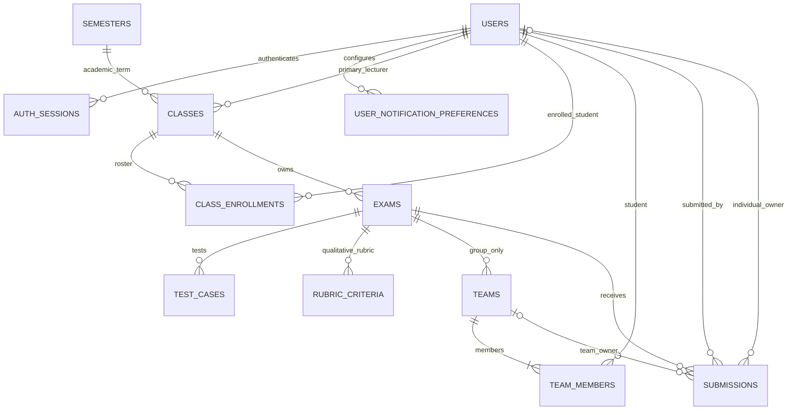
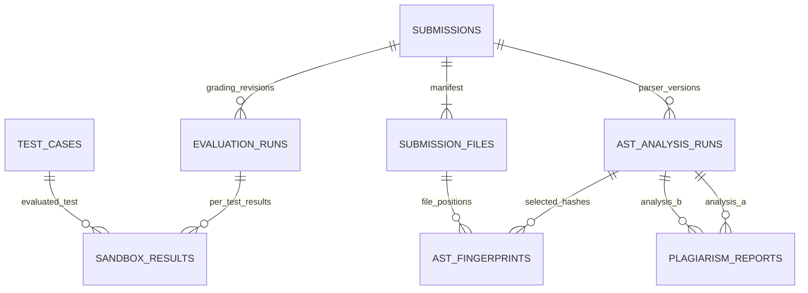
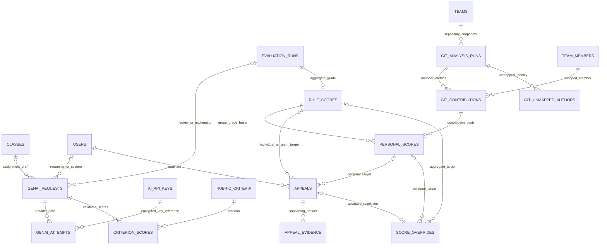
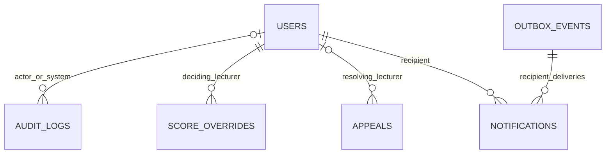

# Thiết kế database 3NF — AITA-Intelligent

**Phiên bản:** 3.0 · **Ngày đối chiếu:** 07/10/2026 · **Hệ quản trị đích:** PostgreSQL 17 · **Phạm vi:** toàn bộ Phase 1 trong SRS.

Nguồn chuẩn: [AITA_Intelligent_SRS_Group5.docx](document/AITA_Intelligent_SRS_Group5.docx), §4–7, UC01–UC24 và decision register §12. Domain/application tương ứng: [CLASS_DIAGRAM_DESIGN.md](CLASS_DIAGRAM_DESIGN.md). Mức triển khai thực tế: [schema.prisma](apps/backend/prisma/schema.prisma) và [migrations](apps/backend/prisma/migrations).

## 1. Phạm vi, quy ước và mức triển khai

Tài liệu này mô tả **schema đích**, gồm các dữ liệu SRS còn thiếu trong repo: team, rubric, AI key pool, criterion scores, điểm công bố/điểm cá nhân, Git analytics, appeal, notification và audit. Không khẳng định schema đích đã tồn tại hay hệ thống đã đạt nghiệm thu. Chỉ hai tài liệu thiết kế được sửa trong công việc này; không áp migration hoặc thay đổi dữ liệu đang dùng.

Baseline Phase 1: Web App; C#/.NET 8 và Java/JDK 17; ZIP 25 MiB; Sandbox 512 MiB/1 vCPU/10s; appeal 48 giờ; Sandbox/AI score theo BR-10; personal score theo BR-12. Không có Peer P2P score, mobile, chatbot nhiều lượt, Tree Edit Distance hay GitLab/Bitbucket. Gmail cá nhân là điều chỉnh người dùng đã chấp thuận, cần được phản ánh vào SRS; cấu hình whitelist không chứng minh người dùng thuộc trường. Python có trong code hiện tại nhưng ngoài baseline ngôn ngữ SRS.

### Quy ước data dictionary

- Bảng dùng snake_case; cột dưới đây dùng camelCase để dễ ánh xạ Prisma. `id: UUID` là kiểu đích, `?` là nullable; trường không có `?` là bắt buộc trừ khi nêu rõ.
- Thời gian đích là `TIMESTAMPTZ`, xử lý và so sánh theo UTC; ngày semester dùng `DATE`. Điểm dùng `NUMERIC(7,4)` trong tính/lưu, chỉ làm tròn khi hiển thị. Giữ đủ precision trước khi clamp/cộng trọng số.
- ID hiện tại của Prisma là `String @default(uuid())` → PostgreSQL **TEXT**, không phải UUID native; DateTime hiện là `TIMESTAMP(3)` không timezone, Float là double precision. Chuyển sang kiểu đích cần migration/backfill kiểm tra riêng; không chạy DDL tham khảo vào DB hiện hữu.
- Định nghĩa enum là CHECK/enum đích; nhiều status hiện tại mới là String, chưa có CHECK tương ứng.
- Tất cả FK nghiệp vụ lịch sử mặc định `ON DELETE RESTRICT`. Archive/disable thay cho hard delete; chỉ draft chưa có kết quả mới có thể xóa child có kiểm soát. AuthSession có thể purge theo hạn/revoke. Composition trong class diagram không phải lệnh cascade DB.

## 2. ERD đích

### 2.1. Portal, lớp, exam và team


```mermaid
erDiagram
  USERS ||--o{ AUTH_SESSIONS : authenticates
  USERS ||--o{ USER_NOTIFICATION_PREFERENCES : configures
  SEMESTERS ||--o{ CLASSES : academic_term
  USERS ||--o{ CLASSES : primary_lecturer
  CLASSES ||--o{ CLASS_ENROLLMENTS : roster
  USERS ||--o{ CLASS_ENROLLMENTS : enrolled_student
  CLASSES ||--o{ EXAMS : owns
  EXAMS ||--o{ TEST_CASES : tests
  EXAMS ||--o{ RUBRIC_CRITERIA : qualitative_rubric
  EXAMS ||--o{ TEAMS : group_only
  TEAMS ||--|{ TEAM_MEMBERS : members
  USERS ||--o{ TEAM_MEMBERS : student
  EXAMS ||--o{ SUBMISSIONS : receives
  USERS ||--o{ SUBMISSIONS : submitted_by
  USERS o|--o{ SUBMISSIONS : individual_owner
  TEAMS o|--o{ SUBMISSIONS : team_owner
```

IndividualOwner và TeamOwner là XOR, không phải hai owner cùng lúc. `submittedBy` là quan hệ riêng, luôn bắt buộc. Team Leader là `TEAM_MEMBERS.role`, không có role TEAM_LEADER trong USERS.

### 2.2. Artifact, evaluation và AST


```mermaid
erDiagram
  SUBMISSIONS ||--|{ SUBMISSION_FILES : manifest
  SUBMISSIONS ||--o{ EVALUATION_RUNS : grading_revisions
  EVALUATION_RUNS ||--o{ SANDBOX_RESULTS : per_test_results
  TEST_CASES ||--o{ SANDBOX_RESULTS : evaluated_test
  SUBMISSIONS ||--o{ AST_ANALYSIS_RUNS : parser_versions
  AST_ANALYSIS_RUNS ||--o{ AST_FINGERPRINTS : selected_hashes
  SUBMISSION_FILES ||--o{ AST_FINGERPRINTS : file_positions
  AST_ANALYSIS_RUNS ||--o{ PLAGIARISM_REPORTS : analysis_a
  AST_ANALYSIS_RUNS ||--o{ PLAGIARISM_REPORTS : analysis_b
```

SimilarityMatrix là read model từ pair rows + trạng thái analysis/submission, không cần bảng lưu toàn bộ ma trận đối xứng. Không có pair cho analysis unavailable; UI biểu diễn ô unavailable thay vì 0%.

### 2.3. AI, điểm, Git và appeal


```mermaid
erDiagram
  EVALUATION_RUNS o|--o{ GENAI_REQUESTS : review_or_explanation
  CLASSES o|--o{ GENAI_REQUESTS : assignment_draft
  USERS o|--o{ GENAI_REQUESTS : requester_or_system
  GENAI_REQUESTS ||--o{ GENAI_ATTEMPTS : provider_calls
  AI_API_KEYS ||--o{ GENAI_ATTEMPTS : encrypted_key_reference
  GENAI_REQUESTS ||--o{ CRITERION_SCORES : validated_scores
  RUBRIC_CRITERIA ||--o{ CRITERION_SCORES : criterion
  EVALUATION_RUNS ||--o| RULE_SCORES : aggregate_grade
  TEAMS ||--o{ GIT_ANALYSIS_RUNS : repository_snapshots
  GIT_ANALYSIS_RUNS ||--o{ GIT_CONTRIBUTIONS : member_metrics
  TEAM_MEMBERS ||--o{ GIT_CONTRIBUTIONS : mapped_member
  GIT_ANALYSIS_RUNS ||--o{ GIT_UNMAPPED_AUTHORS : unmapped_identity
  RULE_SCORES ||--o{ PERSONAL_SCORES : group_grade_basis
  GIT_CONTRIBUTIONS ||--o{ PERSONAL_SCORES : contribution_basis
  RULE_SCORES o|--o{ APPEALS : individual_or_team_target
  PERSONAL_SCORES o|--o{ APPEALS : personal_target
  USERS ||--o{ APPEALS : appellant
  APPEALS ||--o{ APPEAL_EVIDENCE : supporting_artifact
  APPEALS o|--o| SCORE_OVERRIDES : accepted_resolution
  RULE_SCORES o|--o{ SCORE_OVERRIDES : aggregate_target
  PERSONAL_SCORES o|--o{ SCORE_OVERRIDES : personal_target
```

### 2.4. Audit và event delivery


```mermaid
erDiagram
  USERS o|--o{ AUDIT_LOGS : actor_or_system
  USERS ||--o{ SCORE_OVERRIDES : deciding_lecturer
  USERS o|--o{ APPEALS : resolving_lecturer
  OUTBOX_EVENTS ||--o{ NOTIFICATIONS : recipient_deliveries
  USERS ||--o{ NOTIFICATIONS : recipient
```

## 3. Data dictionary

Các bảng dưới đây gồm **33 cấu trúc lưu trữ đích**. AuthSession, analysis/evaluation version, request/attempt và outbox là lựa chọn thiết kế hỗ trợ yêu cầu; chúng không tạo thêm module/screen ngoài SRS.

### 3.1. Tài khoản, session và semester

| Bảng | PK/FK/unique | Cột nghiệp vụ |
| --- | --- | --- |
| `users` | PK id; UNIQUE email; UNIQUE googleSubject khi không null | email VARCHAR(254) chuẩn hóa lower-case; fullName VARCHAR(100); role STUDENT/LECTURER/ADMIN; passwordHash TEXT?; googleSubject TEXT?; isActive BOOLEAN; avatarKey TEXT?; contactPhone VARCHAR(32)?; failedLoginCount INT default 0; lockedUntil TIMESTAMPTZ?; createdAt, updatedAt |
| `auth_sessions` | PK id; FK userId → users; UNIQUE refreshTokenHash | refreshTokenHash CHAR(64); createdAt; expiresAt; revokedAt?; xoay refresh hash atomically, không lưu token rõ |
| `user_notification_preferences` | PK (userId,eventType,channel); FK userId → users | eventType VARCHAR(50); channel IN_APP/WEBSOCKET; enabled BOOLEAN. Preference không được vô hiệu hóa thông báo nghiệp vụ bắt buộc trong FR-NOT |
| `semesters` | PK id; UNIQUE code | code VARCHAR(20); startDate DATE; endDate DATE; CHECK endDate ≥ startDate; mốc dùng cho retention, không phải module quản lý học kỳ mới |

Role/status change phải revoke sessions và ghi audit. Failed-login counter/lock cập nhật atomically để NFR-SEC-002 không bị race; khóa 15 phút sau 5 lỗi liên tiếp. Mật khẩu ít nhất 10 ký tự, bcrypt cost ≥12/Argon2id. Avatar chỉ PNG/JPG <2 MB; DB lưu storage key, không lưu binary/URL public mặc định. `contactPhone` là field thiết kế cho contact information; các field profile khác phải chốt contract trước khi thêm.

### 3.2. Lớp, exam, test và rubric

| Bảng | PK/FK/unique | Cột nghiệp vụ |
| --- | --- | --- |
| `classes` | PK id; FK lecturerId → users; FK semesterId → semesters; UNIQUE classCode; UNIQUE joinCode | classCode VARCHAR(50); courseCode VARCHAR(50); name VARCHAR(150); joinCode VARCHAR(64); createdAt; archivedAt? |
| `class_enrollments` | PK (classId,studentId); FK classId → classes; FK studentId → users | status ACTIVE/DROPPED; enrolledAt; updatedAt |
| `exams` | PK id; FK classId → classes | title VARCHAR(200); descriptionMd TEXT; type INDIVIDUAL/GROUP; allowedLanguage CSHARP/JAVA; gradingWeight NUMERIC(7,4); status; startTime, endTime; minTeamSize INT?; maxTeamSize INT?; createdAt; archivedAt? |
| `test_cases` | PK id; FK examId → exams; UNIQUE (examId,orderIndex) | inputData TEXT; expectedOutput TEXT; scoreWeight NUMERIC(10,4) ≥0; isHidden BOOLEAN; orderIndex INT ≥1; createdAt |
| `rubric_criteria` | PK id; FK examId → exams; UNIQUE (examId,orderIndex) | title VARCHAR(150); description TEXT; orderIndex INT ≥1; createdAt; score scale cố định 0–10 |

Điểm trọng số exam là trọng số của bài/milestone trong bối cảnh môn học; **không thay thế trọng số 4/7 và 3/7 của BR-10**. SRS không quy định tổng các gradingWeight bằng bao nhiêu; cần policy lớp/môn, không đặt một CHECK tổng tùy tiện.

Group phải có `1 ≤ minTeamSize ≤ maxTeamSize`; Individual để hai cột null. C#/.NET 8 và Java/JDK 17 được map bởi cấu hình runner, không lưu thêm bản sao runtime name phụ thuộc language. Resource policy Phase 1 là 512 MiB/1 CPU/10000 ms/test. Nếu lưu cấu hình limits để nâng cấp sau này, đó là version vận hành, không tự thay baseline SRS.

Lifecycle: DRAFT, SCHEDULED, ACTIVE_OPEN, SUBMISSION_CLOSED, GRADING_PENDING, GRADES_PUBLISHED, ARCHIVED. Draft có thể chưa có tests/rubric. Khi mở cần kiểm tra cấu hình đủ để tính thành phần điểm được dùng; sau mở không sửa trực tiếp tests/rubric đã làm căn cứ chấm. Thay đổi có chủ đích cần version và audit, không làm biến đổi evidence của grade đã công bố.

### 3.3. Team và membership

| Bảng | PK/FK/unique | Cột nghiệp vụ |
| --- | --- | --- |
| `teams` | PK id; FK examId → exams; UNIQUE (examId,name); UNIQUE (examId,repositoryCanonicalUrl) | name VARCHAR(100); repositoryCanonicalUrl TEXT GitHub; createdAt; archivedAt? |
| `team_members` | PK id; FK teamId → teams; FK studentId → users; UNIQUE (teamId,studentId) | role MEMBER/LEADER; githubUsername VARCHAR(100); active BOOLEAN; joinedAt; leftAt? |

Không lặp `examId` hoặc `classId` trong team_members: lấy qua team → exam → class. Tránh phụ thuộc bắc cầu chỉ để tạo unique index. Dùng constraint trigger + khóa exam để chặn student thuộc nhiều team active trong cùng exam; unique(teamId,studentId) đơn thuần chỉ chặn trùng **trong một team**.

Partial unique index leader đảm bảo **tối đa một** leader active. Muốn **đúng một** cần deferred constraint trigger ở teams/team_members, chạy khi transaction commit. Tạo team và thành viên/leader trong cùng transaction, không commit team trống. Trigger/service kiểm tra Group type, team size, enrollment ACTIVE, repository/username hợp lệ. Only Lecturer được thay leader (BR-13); Admin support không tự vượt quy tắc này. Change ghi old/new member, actor, reason và timestamp trong audit; không đổi User.role.

### 3.4. Submission, manifest và evaluation history

| Bảng | PK/FK/unique | Cột nghiệp vụ |
| --- | --- | --- |
| `submissions` | PK id; FK examId → exams; FK studentId? → users; FK teamId? → teams; FK submittedBy → users; FK lateApprovedBy? → users | archiveKey TEXT; originalFilename VARCHAR(200); entrypoint TEXT?; fileHashSha256 CHAR(64); artifactType ZIP; submittedAt; isActive BOOLEAN; isLate BOOLEAN; lateApprovalStatus NONE/PENDING/APPROVED/REJECTED; lateApprovedAt?; lateApprovalReason?; supersededAt? |
| `submission_files` | PK id; FK submissionId → submissions; UNIQUE (submissionId,relativePath) | relativePath VARCHAR(240); sizeBytes BIGINT ≥0; sha256 CHAR(64); language CSHARP/JAVA?; isSourceFile BOOLEAN |
| `evaluation_runs` | PK id; FK submissionId → submissions; FK requestedBy? → users; UNIQUE (submissionId,revisionNo) | revisionNo INT ≥1; status; retryCount INT 0..3; queuedAt; startedAt?; completedAt?; configurationHash CHAR(64); runnerImageDigest TEXT; compileStdout TEXT?; compileStderr TEXT?; compileExitCode INT?; compileTimedOut BOOLEAN; compileOom BOOLEAN; failureReason TEXT?; logArtifactKey TEXT? |
| `sandbox_results` | PK id; FK evaluationRunId → evaluation_runs; FK testCaseId → test_cases; UNIQUE (evaluationRunId,testCaseId) | status; actualOutput TEXT?; stderr TEXT?; exitCode INT?; outputTruncated BOOLEAN; executionTimeMs INT ≥0; memoryUsedKb INT ≥0; createdAt |

`studentId` là **owner cá nhân**, `submittedBy` là người thao tác. CHECK XOR owner, thêm kiểm tra individual owner = submitter; Group owner là Team và không điền studentId giả bằng leader. Kiểm tra team thuộc exam, role/enrollment/leader của submitter bằng transaction/constraint trigger. Không đổi owner/submitter sau khi tiếp nhận.

Duplicate hash theo BR-07: Individual UNIQUE(examId,fileHashSha256) cho mọi owner cá nhân trong exam; Group UNIQUE(examId,teamId,fileHashSha256). Index áp dụng cả lịch sử đã superseded, không chỉ active, để không chấp nhận lại ZIP y hệt. Đó là archive hash, khác structural fingerprint; ZIP khác metadata vẫn có thể cùng code nên AST vẫn cần thiết.

Exactly-one current Group Submission áp dụng khi team đã có ít nhất một submission accepted; trước lần nộp đầu có 0. Accepted submission mới trước deadline thay thế phiên cũ atomically; Late/PENDING không được active/enqueue. Lecturer duyệt late phải ghi reason/actor/time và quyết định thay thế bài hiệu lực trong cùng transaction. SRS chưa định nghĩa thứ tự ưu tiên khi nhiều late submission được duyệt, vì vậy approval phải chọn rõ submission cần làm bài chính thức, không tự lấy timestamp lớn nhất.

Manifest là row/file, thay danh sách JSON sourceFiles hiện tại. ZIP lưu ngoài DB bằng key immutable, kiểm tra SHA-256 trước compile/AST. Runtime logs có bounded stdout/stderr và metadata; không lưu Docker socket/API key trong artifact. File không nguồn có thể ở manifest nhưng chỉ nội dung được trusted runner cho phép mới vào môi trường chạy.

EvaluationRun revision mới cho chấm lại; retry kỹ thuật không tạo revision. SandboxResult cùng run/test được upsert idempotent trước completion, khóa sau khi grade được công bố. CHECK/trigger đảm bảo testCase và submission của run thuộc cùng Exam. `scoreEarned`, sandboxScore10 và counts là read projections từ kết quả + test weights, không lưu lặp trong nhiều bảng.

### 3.5. AST, fingerprints và similarity pairs

| Bảng | PK/FK/unique | Cột nghiệp vụ |
| --- | --- | --- |
| `ast_analysis_runs` | PK id; FK submissionId → submissions; UNIQUE (submissionId,analysisVersion) | analysisVersion INT ≥1; status PENDING/RUNNING/COMPLETED/INCOMPLETE/FAILED; parserVersion TEXT; normalizerVersion TEXT; hashVersion TEXT; k INT >0; w INT >0; startedAt?; completedAt?; errorMessage TEXT? |
| `ast_fingerprints` | PK id BIGINT identity; FK analysisRunId → ast_analysis_runs; FK submissionFileId → submission_files; UNIQUE (analysisRunId,submissionFileId,tokenStart) | hashValue BIGINT non-negative; lineStart INT ≥1; lineEnd INT ≥lineStart; tokenStart INT ≥0; tokenEnd INT ≥tokenStart; createdAt |
| `plagiarism_reports` | PK id; FK analysisAId → ast_analysis_runs; FK analysisBId → ast_analysis_runs; UNIQUE (analysisAId,analysisBId); CHECK analysisAId < analysisBId | similarityScore NUMERIC(7,4) 0..100; matchedHashesCount INT ≥0; level LOW/MODERATE/SUSPECTED; computedAt |

Tên `plagiarism_reports` giữ liên hệ code hiện tại, nhưng entity requirements là **SimilarityPair/SimilarityMatrix**. Pair không phải kết luận vi phạm học thuật tự động. CONFIRMED/DISMISSED và ghi chú reviewer trong code cũ là dữ liệu bổ sung, không yêu cầu mới của UC17; không thêm workflow kết luận/kỷ luật ngoài SRS.

Chuẩn hóa identifiers, comments, formatting **và literal values**. Winnowing chạy trong worker, rightmost minimum khi tie. Fingerprint thuộc một file của **cùng submission với analysisRun**, đảm bảo bằng join constraint trigger. Version gồm parser/normalizer/hash/k/w; không trộn fingerprint khác policy.

Scope pair dùng join hai analysis → hai submissions, không lặp examId/teamId trong bảng đích 3NF. Deferred constraint trigger kiểm tra: khác submission; cùng exam; cùng policy; hai analysis comparable; Group khác team. Canonical analysisAId < analysisBId + unique loại đảo chiều/trùng. Bảng hiện tại còn examId và composite FK; xem mục 8 về chuyển đổi và controlled redundancy.

`Similarity = |F_A ∩ F_B| / min(|F_A|,|F_B|) × 100`, F là tập hash phân biệt. ≥80 SUSPECTED; 50–<80 MODERATE; <50 LOW. Empty/incomplete không sinh pair score 0. Matrix read model dùng analysis statuses để hiển thị unavailable; matched regions join fingerprints/source file hai phía để side-by-side.

Matrix hiện hành Group chọn submission official đang active của mỗi team, cùng analysis policy/version. Inactive/superseded submission và analysis versions cũ được giữ cho lịch sử/evidence, không cùng xuất hiện như nhiều bài chính thức của một team.

### 3.6. GenAI request, key pool và criterion scores

| Bảng | PK/FK/unique | Cột nghiệp vụ |
| --- | --- | --- |
| `ai_api_keys` | PK id; UNIQUE (provider,secretFingerprint); FK createdBy → users | provider OPENAI/GEMINI; publicLabel VARCHAR(100); ciphertext BYTEA; nonce BYTEA; authTag BYTEA; encryptionKeyVersion TEXT; secretFingerprint CHAR(64); status; cooldownUntil?; lastUsedAt?; lastProbedAt?; remainingQuota NUMERIC?; createdAt; disabledAt? |
| `genai_requests` | PK id; FK evaluationRunId? → evaluation_runs; FK classId? → classes; FK requestedBy? → users; UNIQUE idempotencyKey | idempotencyKey VARCHAR(200); kind ASSIGNMENT_DRAFT/SEMANTIC_REVIEW/COMPILE_EXPLANATION; status; provider OPENAI/GEMINI; modelName TEXT?; providerRetryCount INT 0..3; correctiveJsonRetryCount INT 0..1; sanitizedPromptHash CHAR(64); resultArtifactKey TEXT?; createdAt; completedAt?; sanitizedError TEXT? |
| `genai_attempts` | PK id; FK requestId → genai_requests; FK apiKeyId → ai_api_keys; UNIQUE (requestId,attemptNo) | attemptNo INT ≥1; startedAt; completedAt?; httpStatus INT?; tokensUsed INT ≥0; sanitizedError TEXT? |
| `criterion_scores` | PK (requestId,criterionId); FK requestId → genai_requests; FK criterionId → rubric_criteria | score NUMERIC(7,4) 0..10; comment TEXT; createdAt |

Draft context: classId bắt buộc, evaluationRunId null, requestedBy là Lecturer. Semantic/explanation context: evaluationRunId bắt buộc, classId null; requestedBy có thể null cho system job. CHECK phân loại context, không dùng một FK polymorphic không kiểm chứng. Draft response lưu tạm/được review, chỉ ghi Exam/TestCase/RubricCriterion khi Lecturer chọn lưu. Không tự publish nội dung AI.

Semantic request mới được có CriterionScores; criterion phải thuộc rubric của exam trong EvaluationRun. Response validation kiểm tra JSON schema, ID criterion, range, missing/duplicate criteria trước khi commit. Invalid JSON có một corrective retry; vẫn sai → NEEDS_MANUAL_REVIEW. Key/provider failure hết retries → DEGRADED và provisional result, không xóa Sandbox/AST.

Key của từng attempt phải thuộc provider được cấu hình cho request; không đổi model/provider giữa retry mà mất dấu vết policy. Nếu thêm cross-provider fallback sau này cần ghi model/provider riêng ở attempt và version hóa policy đó.

API key AES-256-GCM at rest: nonce 12 bytes, authTag 16 bytes; master encryption key nằm ngoài DB và không dùng JWT_SECRET làm master key. Không API/log nào trả ciphertext hoặc plaintext cho client; admin chỉ xem label/fingerprint masked. Provider call decrypt trong memory. Round-robin lease dùng transaction/row lock để không chọn key disabled/cooldown; 429 → cooldown 24h, hết hạn vẫn cần probe thành công mới active.

Không gửi email/name/student ID/owner metadata sang provider. Payload chỉ sanitized code/rubric/diagnostics; dùng zero-retention API mode khi có. Artifact/provider response đã validate không phải nguồn plaintext key. `genai_attempts` lưu metadata call để quản lý retries/quota, không lưu Authorization header.

### 3.7. Git analytics và unmapped evidence

| Bảng | PK/FK/unique | Cột nghiệp vụ |
| --- | --- | --- |
| `git_analysis_runs` | PK id; FK teamId → teams; FK requestedBy? → users; UNIQUE (teamId,revisionNo) | revisionNo INT ≥1; status PENDING/RUNNING/COMPLETED/FAILED/UNAVAILABLE; repositoryRevision TEXT?; rangeStart, rangeEnd TIMESTAMPTZ; metricPolicyVersion TEXT; generatedFilePolicyVersion TEXT; teamSizeSnapshot INT ≥1; synchronizedAt?; failureReason TEXT? |
| `git_contributions` | PK id; FK analysisRunId → git_analysis_runs; FK teamMemberId → team_members; UNIQUE (analysisRunId,teamMemberId); FK justificationApprovedBy? → users | commitCount INT ≥0; locAdded INT ≥0; locDeleted INT ≥0; mergedPrCount INT ≥0; contributionPct NUMERIC(7,4)? 0..100; approvedJustification TEXT?; justificationApprovedAt? |
| `git_unmapped_authors` | PK (analysisRunId,githubIdentity); FK analysisRunId → git_analysis_runs | githubIdentity TEXT; commitCount, locAdded, locDeleted, mergedPrCount INT ≥0 |

GitContribution gắn **TeamMember** theo ISS-09, không chỉ User global. Team suy ra từ GitAnalysisRun, không lặp teamId/examId trong từng contribution. Trigger đảm bảo teamMember thuộc team của run. Tổng metrics tính từ cùng một version/range, loại file generated trước khi tính shares. Snapshot lỗi không thay snapshot thành công trước; unmapped authors phải hiển thị và cho Lecturer sửa mapping rồi chạy version mới.

`C_i = (0.35×CommitShare + 0.40×LOCShare + 0.25×PRShare)×100%`. `contributionPct` là kết quả aggregate được materialize theo version để giữ evidence, không phải thuộc tính của User/TeamMember. Warning suy ra từ C_i <5% và justification approval; không giảm C_i hoặc đổi công thức chỉ vì justification được chấp thuận.

SRS chưa định nghĩa LOC Share dùng added+deleted hay net, cũng chưa quy định metric denominator bằng 0/unmapped totals. `metricPolicyVersion` dành cho quyết định đó. Không tự bỏ PR weight rồi chia lại 0.35/0.40 hoặc tự gán unmapped activity cho leader. Chưa có policy/dữ liệu hợp lệ thì để contributionPct unavailable, không tạo PersonalScore giả.

### 3.8. RuleScore, PersonalScore và override

| Bảng | PK/FK/unique | Cột nghiệp vụ |
| --- | --- | --- |
| `rule_scores` | PK id; FK evaluationRunId → evaluation_runs; UNIQUE evaluationRunId; FK fallbackApprovedBy? → users; FK publishedBy? → users | status COMPUTED/PROVISIONAL/NEEDS_MANUAL_REVIEW/PUBLISHED/SUPERSEDED; isProvisional BOOLEAN; scorePolicyVersion TEXT; publishedScore10 NUMERIC(7,4)? 0..10; computedAt; publishedAt?; fallbackApprovedAt?; fallbackApprovalReason TEXT? |
| `personal_scores` | PK id; FK ruleScoreId → rule_scores; FK gitContributionId → git_contributions; UNIQUE (ruleScoreId,gitContributionId,revisionNo); FK publishedBy? → users | revisionNo INT ≥1; status; personalPolicyVersion TEXT; publishedScore10 NUMERIC(7,4)? 0..10; computedAt; publishedAt?; isCurrent BOOLEAN |
| `score_overrides` | PK id; FK ruleScoreId? → rule_scores; FK personalScoreId? → personal_scores; FK decidedBy → users; FK appealId? → appeals; UNIQUE appealId khi có | ordinal INT ≥1; previousScore10, newScore10 NUMERIC(7,4) 0..10; reason TEXT; changedAt; XOR grade target; unique ordinal theo từng target |

Một submission có nhiều EvaluationRuns và nhiều RuleScores lịch sử, nhưng query điểm hiệu lực chọn đúng grade published/current theo revision, không lấy dòng có timestamp ngẫu nhiên. RuleScore tương ứng RuleScores trong SRS; cardinality 1:1 là **một grade hiện hành**, không cấm history/regrade. Một evaluation run chỉ có tối đa một RuleScore. Publish revision mới phải lock submission và chuyển grade hiệu lực trước sang SUPERSEDED atomically; publishedAt/score cũ không bị sửa. isProvisional lưu độc lập với publication status để kết quả fallback được công bố vẫn có nhãn provisional.

PersonalScore owner đi qua GitContribution → TeamMember → User, không lặp studentId/teamId. Constraint trigger đảm bảo contribution thuộc đúng team của RuleScore's submission; Individual không có PersonalScore. Mỗi published team grade có đúng một personal version hiện hành cho mỗi thành viên được tính điểm; unique dựa trên join owner cần trigger/transaction, không thể được bảo đảm bởi unique(ruleScoreId,gitContributionId) khi cùng member có nhiều Git versions.

Các điểm live `sandboxScore10`, `aiScore10`, `netScore10`, `contributionFactor`, `effectiveFinalScore10` là read projections. `publishedScore10` là snapshot **quyết định công bố**, immutable; override lưu sự kiện mới, không ghi đè snapshot/evidence. Nếu cần cache projections để tăng tốc, phải ghi rõ cache/materialization và rebuild từ source/version, không coi các cột cache là nguồn nghiệp vụ thứ hai.

- Sandbox10: `10 × sum(weight của test passed) / sum(weight tất cả test)`, tổng weight >0.
- Net10: `(Sandbox10 ×0.4 + AI10 ×0.3)/0.7` = `Sandbox10 ×4/7 + AI10 ×3/7`.
- AI degraded/unavailable: Net provisional = Sandbox10 **chỉ khi Lecturer phê duyệt fallback**; giữ approval/audit và các stage đã hoàn tất.
- Personal10: `min(10, effectiveTeamScore10 × clamp(C_i/(100/teamSizeSnapshot),0.5,1.2))`.
- Effective grade: latest authorized ScoreOverride của target nếu có, nếu không dùng publishedScore10. Penalty không chia lại, không group-normalized balancing (ISS-10).

SRS chỉ quy định per-criterion 0–10, chưa quy định công thức gộp AI10. Không tự coi cleanCodeScore 0–100 hoặc một weighted average tùy ý là yêu cầu đã duyệt. Trước scoring cần chốt semantic aggregation policy/version; trường hợp thiếu component hoặc tổng test weight 0 phải giữ manual/provisional, không âm thầm gán 0 để publish.

### 3.9. Appeal và evidence

| Bảng | PK/FK/unique | Cột nghiệp vụ |
| --- | --- | --- |
| `appeals` | PK id; FK appellantId → users; FK ruleScoreId? → rule_scores; FK personalScoreId? → personal_scores; FK resolvedBy? → users; XOR target theo scope | scope INDIVIDUAL_RESULT/TEAM_GRADE/PERSONAL_SCORE; justification TEXT; status SUBMITTED/IN_REVIEW/ACCEPTED/REJECTED; submittedAt; decisionReason TEXT?; resolvedAt? |
| `appeal_evidence` | PK id; FK appealId → appeals | storageKey TEXT; originalFilename VARCHAR(200); contentType VARCHAR(100); sizeBytes BIGINT ≥0; sha256 CHAR(64); uploadedAt |

IndividualResult/TeamGrade trỏ RuleScore, PersonalScore trỏ PersonalScore. Verify grade đã published, actor có quyền và `submittedAt ≤ publishedAt + 48h` bằng server clock/transaction; **không tính từ submission/completion time**. Team Leader được appeal team grade; TeamMember chỉ appeal own personal; Student own individual. Lecturer sở hữu class mới resolve; Admin support không thay quyết định của Lecturer nếu baseline không cấp quyền đó.

Partial unique index chặn appeal active cùng RuleScore hoặc cùng PersonalScore khi status SUBMITTED/IN_REVIEW. Chỉ hai index này chưa chặn được cùng scope qua các revision. Thêm deferred join constraint trigger và transaction lock theo logical scope: Individual = (exam,student,INDIVIDUAL_RESULT), Team = (exam,team,TEAM_GRADE), Personal = (exam,team,student,PERSONAL_SCORE). Scope suy ra qua grade/evaluation/contribution, không cần chép các ID vào appeals; các writer dùng cùng advisory transaction lock hoặc parent-scope lock để chống concurrent inserts. Quy tắc SRS là không trùng **active** appeal, không cấm mọi appeal lịch sử. Scope/type phải khớp Individual/Group của exam. ACCEPTED cần một ScoreOverride cùng target; REJECTED cần feedback và không có override từ appeal đó.

Accepted override cập nhật effective grade, tính lại PersonalScores liên quan nếu team grade đổi, ghi audit và outbox atomically. Optional regrade tạo EvaluationRun revision mới. Publication timestamp cũ không bị sửa khi resolve/override để tự gia hạn cửa sổ appeal. Evidence được lưu bảo vệ theo quyền target; SRS chưa đặt file limit evidence nên dùng cấu hình validation được chốt riêng, không suy diễn limit ZIP sang appeal.

### 3.10. Audit, outbox và notifications

| Bảng | PK/FK/unique | Cột nghiệp vụ |
| --- | --- | --- |
| `audit_logs` | PK id; FK actorUserId? → users | actorType USER/SYSTEM; action VARCHAR(80); targetType VARCHAR(50); targetId UUID; reason TEXT?; changeEvidence JSONB; occurredAt |
| `outbox_events` | PK id; UNIQUE idempotencyKey | idempotencyKey VARCHAR(200); eventType VARCHAR(80); aggregateType VARCHAR(50); aggregateId UUID; payload JSONB; occurredAt; dispatchedAt?; dispatchAttempts INT ≥0; lastSanitizedError TEXT? |
| `notifications` | PK id; FK eventId → outbox_events; FK recipientUserId → users; UNIQUE (eventId,recipientUserId) | title VARCHAR(200); body TEXT; createdAt; readAt? |

Audit append-only gồm score override, leader change, account/role/status, key administration và late approval/security events. Leader-change evidence có oldLeader/newLeader/reason/time; score-change evidence có old/new/actor/target. targetType/targetId là logical reference có kiểm tra application, **không phải FK DB đa hình**. Không ghi key/token rõ hoặc toàn bộ confidential payload vào audit.

Outbox là lựa chọn thiết kế để DB mutation và event không bị lệch khi Redis/WebSocket lỗi. Submission/result/appeal transaction chèn event; dispatcher publish retry, consumers idempotent. Notifications có recipient riêng, không đặt danh sách member IDs trong một cột rồi coi là quan hệ normalized. WebSocket revalidate session/resource access; nhóm nhận đúng các thành viên bị ảnh hưởng và Lecturer/Admin có quyền. In-app state hỗ trợ reconnect; không tự áp 12 tháng retention cho notification history vì UC23 không yêu cầu lịch sử dài hạn.

### 3.11. Status domains và CHECK bổ sung

| Domain | Giá trị / invariants |
| --- | --- |
| EvaluationRun.status | QUEUED, SANDBOX_RUNNING, GENAI_REVIEWING, AI_REVIEW_SKIPPED, AST_ANALYZING, SCORE_AGGREGATE, GRADED, PLAGIARISM_FLAGGED, EXECUTION_ERROR, FAILED_QUEUEING |
| SandboxResult.status | ACCEPTED, WRONG_ANSWER, TIME_LIMIT_EXCEEDED, MEMORY_LIMIT_EXCEEDED, RUNTIME_ERROR; COMPILE_ERROR nằm ở run compiler outcome; OUTPUT_LIMIT_EXCEEDED là bổ sung vận hành |
| GenAIRequest.status | PENDING, RUNNING, SUCCEEDED, NEEDS_MANUAL_REVIEW, DEGRADED, SKIPPED, FAILED |
| AIAPIKey.status | PENDING_VALIDATION, ACTIVE, COOLDOWN, DISABLED, INVALID, EXHAUSTED |
| PersonalScore.status | COMPUTED, PROVISIONAL, NEEDS_MANUAL_REVIEW, PUBLISHED, SUPERSEDED; provisional label suy ra từ RuleScore basis |
| Published grade | publishedAt, publishedBy và publishedScore10 cùng có giá trị sau publish; SUPERSEDED vẫn giữ chúng; chưa publish để null |
| Late approval | isLate=false → NONE; isLate=true → PENDING/APPROVED/REJECTED. APPROVED cần actor/time/reason; PENDING không isActive/enqueue |
| Membership | active=true → leftAt null; leader phải active; membership changes không được để team không có leader hoặc sai kích thước tại commit |
| Audit actor | USER cần actorUserId; SYSTEM để actorUserId null; immutable after insert |

Trạng thái một pipeline là summary; AI/AST/Sandbox failures có dữ liệu độc lập. Skip/unavailable không được tạo score/fingerprint giả. Các limits khác như expanded ZIP size/compiler/output/PID cap là cấu hình hardening, không tự thay baseline SRS.

## 4. Chứng minh và giới hạn của mô hình 3NF

1. **1NF:** roster/member/test/criterion/file/fingerprint/recipient là row riêng; không lưu CSV memberIds hay mảng điểm thay cho child relation. JSONB ở audit/outbox là một immutable event document, không thay cho dữ liệu nghiệp vụ cần FK/unique.
2. **2NF:** ClassEnrollment và notification preferences phụ thuộc toàn bộ khóa ghép. CriterionScore phụ thuộc (request,criterion). Không chép course/exam attributes xuống từng membership hoặc score row.
3. **3NF:** User identity chỉ ở users; semester dates chỉ ở semesters; exam metadata chỉ ở exams; repository ở teams; file path ở submission_files. TeamMember không lặp examId/classId; GitContribution không lặp teamId; PersonalScore không lặp studentId; matrix pair scope đi qua analysis/submission.
4. **Read models:** sandboxScore/AI aggregate/factor/effective score/heatmap là projections. ContributionPct và published grade là versioned aggregate/decision facts cần lưu theo SRS/audit; không quảng cáo các cache/projection vật lý tùy chọn là base relation 3NF. Khi materialize để hiệu năng, ghi rõ source, version và transaction/rebuild policy.
5. **Controlled redundancy hiện hữu:** Prisma PlagiarismReport có examId + composite FK và Submission có sourceFiles JSON/totalScore. Chúng không tự mất đi vì tài liệu mới; mục 8 phân biệt schema hiện tại với schema đích. Chỉ migrate sau khi có kế hoạch tương thích/backfill.

Không đưa k-gram/Winnowing, normalize AST hay toàn bộ score computation vào SQL trigger. Trigger dùng cho integrity/concurrency; worker tính toán, DB lưu facts/results và index.

## 5. Integrity, transaction và concurrency

| Quy tắc SRS | Database enforcement đích | Application/worker enforcement |
| --- | --- | --- |
| Đúng một leader | Partial unique cho tối đa một; deferred constraint trigger kiểm tra ≥1 tại commit | TeamService lock team/exam; chỉ Lecturer, role changes + audit atomically |
| Student một team/exam | Unique trong team + deferred join trigger; lock exam chống write skew | Kiểm tra enrollment, team size và membership trước commit |
| Repository không trùng team/exam | UNIQUE(examId,repositoryCanonicalUrl) | Canonicalize GitHub URL, không dùng case/đuôi `.git` để lách unique |
| Group submission owner | CHECK XOR; FK team/student; trigger team thuộc exam | Check leader/enrollment/server deadline, lưu submittedBy |
| Một bài nhóm hiệu lực | Partial unique(teamId) WHERE isActive; state guard accepted/non-late-pending | Lock team, supersede old + insert new + outbox cùng transaction |
| Hash BR-07 | Hai partial unique index Individual/Group | Validate archive/hash trước receipt; trả duplicate rõ |
| Late BR-02 | Late approval fields consistency; isActive false khi PENDING | Không enqueue trước approval, approval + audit + outbox atomic |
| Roster import | FK/unique; toàn batch một transaction | Serializable + validate signed preview/mapping/file/user/class |
| Test đúng exam | Deferred join trigger từ run/submission/test | Trusted configuration, idempotent upsert(run,test) |
| Fingerprint đúng file/submission | FK + unique vị trí; deferred join trigger | Hash/version/positions validated, parser không execute bài |
| Similarity đúng scope | FK analysis pair + canonical CHECK/unique; join trigger cùng exam, khác submission/team, compatible policy | Chỉ complete/comparable runs, distinct containment và threshold |
| Criterion đúng rubric | FK + PK(request,criterion); trigger context/exam | Validate JSON schema/range/completeness, corrective retry ≤1 |
| Personal đúng team/member | FK contribution/grade; join trigger; current-version uniqueness qua join | Freeze teamSize/metric policy, BR-12 sau team grade final |
| Appeal quyền/48h | XOR target; partial unique active + join trigger kiểm tra scope qua revisions; resolution consistency | Server clock + locked scope, publishedAt immutable, ownership/role |
| Override/audit/outbox | Immutable rows, FK actor/target; one appeal override | Transaction score/appeal/audit/event; recalc affected personal grades |

### 5.1. DDL minh họa ràng buộc đích

Các đoạn sau chỉ minh họa index/CHECK cho schema đích theo data dictionary. Không phải migration đã chạy hay script bootstrap DB hiện tại. Deferred trigger functions phải được triển khai/kiểm thử trong migration riêng.

```sql
CREATE UNIQUE INDEX uq_team_active_leader
  ON team_members ("teamId")
  WHERE active AND role = 'LEADER';

ALTER TABLE submissions ADD CONSTRAINT ck_submission_owner_xor
  CHECK (("studentId" IS NOT NULL) <> ("teamId" IS NOT NULL));

ALTER TABLE submissions ADD CONSTRAINT ck_individual_submitter
  CHECK ("studentId" IS NULL OR "studentId" = "submittedBy");

CREATE UNIQUE INDEX uq_team_current_submission
  ON submissions ("teamId") WHERE "isActive" AND "teamId" IS NOT NULL;

CREATE UNIQUE INDEX uq_individual_archive_hash
  ON submissions ("examId", "fileHashSha256") WHERE "teamId" IS NULL;

CREATE UNIQUE INDEX uq_team_archive_hash
  ON submissions ("examId", "teamId", "fileHashSha256") WHERE "teamId" IS NOT NULL;

ALTER TABLE plagiarism_reports ADD CONSTRAINT ck_pair_canonical
  CHECK ("analysisAId" < "analysisBId");

CREATE UNIQUE INDEX uq_active_aggregate_appeal
  ON appeals ("ruleScoreId")
  WHERE "ruleScoreId" IS NOT NULL AND status IN ('SUBMITTED', 'IN_REVIEW');

CREATE UNIQUE INDEX uq_active_personal_appeal
  ON appeals ("personalScoreId")
  WHERE "personalScoreId" IS NOT NULL AND status IN ('SUBMITTED', 'IN_REVIEW');
```

**CHECK không thể thay join trigger:** không dùng `CHECK (EXISTS (...))` truy vấn team/exam/enrollment. Dùng `CREATE CONSTRAINT TRIGGER ... DEFERRABLE INITIALLY DEFERRED` và lock parent row theo thứ tự nhất quán. Khi đổi parent (team exam, test exam, file submission...) phải trigger kiểm tra cả chiều parent/child hoặc cấm reparent sau khi có evidence; trigger chỉ ở insert child không bảo vệ update parent.

### 5.2. Transaction bắt buộc

- Team create/import: lock exam → validate enrolled members/size/repo → insert team/member/leader → audit/outbox → deferred integrity check → commit.
- Leader replace: lock team → assert Lecturer → old LEADER thành MEMBER, new MEMBER thành LEADER → append old/new/reason audit → commit. Không chỉ thêm unique index rồi cho phép 0 leader.
- Submission accepted: persist immutable artifact → transaction lock owner scope/exam → check lifecycle/deadline/hash → supersede old accepted nếu hợp lệ → insert receipt/manifest/run/outbox → commit. Artifact và SQL không có distributed transaction: upload staging rồi promote, garbage-collect artifact không được reference khi SQL rollback.
- Publish/resolve: lock grade/appeal → check range/authority/window → append override or publication → recalc personal versions khi cần → audit/outbox → commit. External GenAI/Git/Docker/WebSocket call nằm ngoài transaction giữ lock DB.
- Technical retry: dùng cùng run/stage idempotency key. NFR-REL-001 initial + tối đa 3 retries, delay 5/15/45s. Regrade do Lecturer tạo new EvaluationRun revision; không overwrite published evidence.

## 6. Index và read models

| Query | Index/chiến lược đích |
| --- | --- |
| Auth session/user | users(email), users(googleSubject); auth_sessions(userId), expiresAt |
| Roster/dashboard | class_enrollments(studentId,status); classes(lecturerId); exams(classId,status,endTime) |
| Group membership | team_members(teamId,active); team_members(studentId,active); teams(examId) |
| Submission listing/history | submissions(examId,submittedAt); submissions(studentId,submittedAt); submissions(teamId,submittedAt) |
| Pending work/outbox | evaluation_runs(status,queuedAt); outbox_events(occurredAt) WHERE dispatchedAt IS NULL |
| Test/criterion | unique order per exam; sandbox_results(evaluationRunId,testCaseId); criterion_scores(requestId,criterionId) |
| Fingerprint lookup | ast_analysis_runs(submissionId,status); ast_fingerprints(hashValue,analysisRunId); ast_fingerprints(analysisRunId,submissionFileId,tokenStart) |
| Similarity matrix | plagiarism_reports(analysisAId), (analysisBId); join analysis/submission scope index, không materialize ma trận N×N gồm ô rỗng |
| Git/personal report | git_analysis_runs(teamId,revisionNo); git_contributions(analysisRunId,teamMemberId); personal_scores(ruleScoreId,isCurrent) |
| Appeals | appeals(status,submittedAt); target partial indexes; joins grade → run → submission → exam → class |
| Audit/notification | audit_logs(targetType,targetId,occurredAt), actorUserId; notifications(recipientUserId,createdAt), readAt |

Matrix thực hiện so khớp hash sets ở worker và lưu pair facts; DB joins/read models cung cấp report. Không khẳng định một B-tree hash index khiến mọi pairwise analysis thành O(log N). Với 300 uploads/NFR-PERF, cần load test ingest/queue capacity và kiểm tra index/plan, không suy ra performance chỉ từ ERD.

## 7. Privacy, retention và vận hành

- Student đọc own individual hoặc team submission; Lecturer own class và Admin authorized support. Download ZIP/log/source/evidence và WebSocket phải dùng cùng authorization policy, không chỉ che button UI.
- Hidden inputs/expected outputs và stdout/stderr có thể tiết lộ test: student response cần sanitize; DB/operator evidence vẫn giữ nguyên để Lecturer điều tra. Matrix/side-by-side chỉ Lecturer/Admin.
- GenAI master key tách DB/`.env` version control; encrypted key bytes không trả API. Password/refresh hash, key administration/audit logs không chứa secret rõ.
- ZIP và detailed evaluation/execution logs giữ active **12 tháng sau semesters.endDate**, rồi chuyển cold/archive storage theo NFR-RET-001. Không lấy 12 tháng từ submittedAt. Metadata/key archive vẫn giữ reference để truy xuất lịch sử được phép; không hard-delete grade/audit bằng cascade.
- Object storage lifecycle hoặc retention worker tính cutoff qua class → semester. Archive operation idempotent, cập nhật reference sau khi copy/verify hash thành công; không xóa bản active trước khi kiểm tra bản cold.
- Redis/BullMQ dùng persistent configuration; SQL receipt/outbox giúp enqueue recovery. Worker restart không mất persisted job; stage completion khác grade publication.
- Notification history dài hạn, backup/RTO/RPO và evidence-upload limit không được SRS ấn định; tài liệu không tự đưa thêm SLA/chính sách pháp lý. Cần quyết định vận hành trước triển khai public.

## 8. Mapping hiện tại → thiết kế đích

Schema repo hiện có **11 models**; AIReview có bảng nhưng chưa có pipeline semantic/key rotation. Cột thực tế camelCase, IDs TEXT, DateTime TIMESTAMP(3), Float double precision. Table đích mới và CHECK/index minh họa chưa được áp.

| Hiện tại | Đích / việc còn thiếu |
| --- | --- |
| User | Profile/contact/preference, account lockout; giữ googleSubject/isActive; password minimum 10 ở service |
| AuthSession | Giữ session rotation/revocation; kiểm tra expiry/cookie/role invalidation |
| Class.semester String | Thêm courseCode/joinCode; map semester sang semesters/endDate cho retention |
| ClassEnrollment | Giữ composite PK; trigger/validation liên kết team/enrollment |
| Exam | Individual/Group, lifecycle, gradingWeight, team limits; C#/Java baseline/resource policy |
| TestCase | Giữ input/output/visibility/order/weights; khóa hoặc version config sau mở |
| Submission | sourceCodeUrl hiện là archive key hoặc legacy raw text; bổ sung submittedBy, owner XOR/team/late/supersession/hash constraints; totalScore chỉ cache Sandbox hiện tại, chưa là Net10 |
| Submission.sourceFiles Json | Backfill submission_files từ manifest; không coi JSON list là toàn bộ mô hình nguồn 3NF |
| SubmissionTestResult | sandbox_results theo EvaluationRun để giữ regrade; có stdout/stderr/exit/outputTruncated hiện tại; cần same-exam guard |
| Submission.astStatus/astVersion/astK/astW | Backfill ASTAnalysisRun; giữ parser/normalizer/config version và incomplete state |
| ASTFingerprint | Hiện submissionId/sourcePath/hash/positions; map sang analysisRunId/submissionFileId; chưa có analysis history |
| PlagiarismReport | Hiện examId + submissionA/B composite FK; score CHECK 0..100 có trong migration, canonical A<B mới ở service, **chưa có DB CHECK A<B**; target analysis-pair/version scope và Group cross-team guard |
| AIReview | Chưa đủ CriterionScores/GenAIRequest/API key pool/RuleScore; giữ dữ liệu legacy thay vì tự coi cleanCodeScore là AI10 hợp lệ |
| Không có Team/Git/Appeal/Grade/Audit/Notification models | Thêm các bảng tại mục 3 theo migration version hóa, triển khai workflow/authorization tương ứng |

### Khác biệt hành vi cần lưu trong kế hoạch triển khai

| SRS | Code hiện tại khi đối chiếu |
| --- | --- |
| C#/Java baseline | Có thêm Python; cần cập nhật SRS nếu tiếp tục trong phạm vi nghiệm thu |
| Institutional domains/config | Cho phép Gmail theo yêu cầu người dùng; cập nhật policy/SRS, không tự xác nhận affiliation |
| Duplicate hash BR-07 | Hiện chỉ băm/lưu, chưa có scoped rejection/index |
| ZIP ratio ≤100:1 | readZip hiện nới kiểm tra ratio khi entry ≤1 MiB; cần sửa validation để đúng NFR-SEC-004 |
| Late chờ Lecturer duyệt | Hiện từ chối sau endTime, chưa lưu Late/PENDING |
| Group leader/active official submission | Chưa có team ownership/supersession models |
| Worker initial +3 retries 5/15/45s | Hiện BullMQ attempts=3 tổng lượt, exponential base 1s |
| AST abstract literal, incomplete unavailable | Hiện giữ literal value; empty similarity trả 0; chưa có cross-team guard/heatmap/side-by-side |
| BR-10/BR-12 0–10 | Hiện totalScore cộng test weights; chưa là final/team/personal grade |
| WebSocket/in-app | Hiện polling |
| Retention 12 tháng sau semester end | Hiện local ZIP/log không có archive scheduler |

## 9. Traceability dữ liệu tới SRS

| Requirement family | UC | Bảng/read model đích |
| --- | --- | --- |
| FR-AUTH-001..006, NFR-SEC-001..003 | UC01, UC04 | users, auth_sessions, audit_logs |
| FR-PROF-001..002, FR-DASH-001 | UC02, UC04 | users, user_notification_preferences, dashboard projection |
| FR-CLS-001..003 | UC05 | semesters, classes, class_enrollments |
| FR-IMP-001..004 | UC03 | users/enrollments transaction; preview receipt không bắt buộc bảng import history |
| FR-EXM-001..006 | UC06, UC07 | exams, test_cases, rubric_criteria |
| FR-EXM-007 | UC11 | genai_requests/attempts, Lecturer-reviewed exam draft |
| FR-TEAM-001..006, BR-11/13 | UC24 | teams, team_members, audit_logs |
| FR-SUB-001..008, BR-02/07/11 | UC08 | submissions, submission_files, owner/late/current constraints |
| FR-QUE-001..002, NFR-REL-001..002 | UC18, UC23 | evaluation_runs, outbox_events, Redis jobs, notifications |
| FR-SBX-001..006, FR-RES-001..002 | UC09, UC10 | evaluation_runs, sandbox_results, protected log artifacts |
| FR-AI-001..003, FR-AI-007, BR-10 | UC12 | genai_requests, genai_attempts, criterion_scores, rule_scores |
| FR-AI-004..006, NFR-SEC-006 | UC14 | ai_api_keys, genai_attempts, audit_logs |
| FR-AI-008, ISS-01 | UC13 | COMPILE_EXPLANATION request and sanitized response artifact |
| FR-AST-001..006, FR-PLG-001..003, BR-03 | UC15–UC17 | ast_analysis_runs, ast_fingerprints, plagiarism_reports, matrix/matched-regions projection |
| FR-GIT-001..006, BR-05/12 | UC19, UC20 | git_analysis_runs, git_contributions, git_unmapped_authors, personal_scores |
| FR-APL-001..005, BR-08/09 | UC21, UC22 | appeals, appeal_evidence, score_overrides, publication timestamps |
| FR-NOT-001..002 | UC23 | outbox_events, notifications, authorized WebSocket delivery |
| FR-AUD-001, NFR-OBS-001 | UC22, UC24, admin/security actions | audit_logs, immutable override/event facts |
| NFR-RET-001, §6.4 | Cross-cutting | semesters endDate, artifact/archive keys và retention worker |

## 10. Migration và tiêu chí kiểm tra thiết kế

Đề xuất thứ tự triển khai: (1) profile/semester/exam type/teams/rubric; (2) ownership/hash/late/current submission và EvaluationRun; (3) AST analysis version + normalized file mapping; (4) GenAI keys/criterion/RuleScore/publication; (5) Git/PersonalScore; (6) appeal/override/audit/outbox/notification/retention. Tất cả dùng migration version hóa; không reset DB để chuyển thiết kế.

Backfill cần kiểm tra IDs hợp lệ trước cast UUID, timezone của dữ liệu cũ, duplicates/hash/pair order, mapping Semester và test-point scale. Legacy submissions giữ artifactType/điểm cũ, không tự đổi mọi totalScore thành Net10. Không tự tạo AI/điểm cá nhân giả cho dữ liệu chưa được review. Bảng/cột compatibility giữ đến khi application và client chuyển xong.

Kiểm chứng khi triển khai: concurrent leader changes; hai uploads cùng team; duplicate hash trong scope khác nhau; rollback roster; Late không enqueue; grade/test/file/pair cùng scope; cross-team filter; empty/incomplete AST; response/key cooldown; zero Git denominator/unmapped identities; BR-10/12 bounds; appeal đúng 48h và actor; publish/override/audit/outbox atomic; download/WebSocket RBAC; archive đúng semester-end cutoff. Các kiểm tra này là acceptance cần thực hiện, không phải tuyên bố đã đạt chỉ vì tài liệu có sơ đồ.
